# Product Requirements Document: HireRight

## Build Readiness Checklist
Confirm these BEFORE starting Phase 0 of the implementation sequence. None of these change the product scope — they are environment facts that, if missed, cost time mid-build.

| # | Item | Default / Note | Filled in |
|---|------|---------------|-----------|
| 1 | Operating system of dev machine | Windows / macOS / Linux / WSL — affects native binary compatibility (e.g., Tailwind v4 Rust binary blocked by Windows AppLocker) | ☐ |
| 2 | Node.js version installed | Node 20+ required (Node 18 is deprecated) | ☐ |
| 3 | Supabase Personal Access Token available? | Required for `supabase db push` from CLI without manual login each time | ☐ |
| 4 | Supabase CLI installed? | `supabase --version` should return | ☐ |
| 5 | Vercel CLI installed? | `vercel --version` should return | ☐ |
| 6 | Git identity configured for this repo? | `git config user.email` + `user.name` set — prevents history rewrites later | ☐ |
| 7 | GitHub repo created? | Empty repo with default branch `main` | ☐ |
| 8 | Tailwind version preference | v3 unless v4 features explicitly required (v4's Rust binary breaks on Windows AppLocker) | ☐ |
| 9 | shadcn/ui install phase | Phase 0 (recommended — set up theming once) or deferred | ☐ |
| 10 | Number of test users to seed | Default 2 (USER_A, USER_B) — see Section 7 canonical entities | ☐ |
| 11 | claude-prd-skills-hooks installed? | Run `install.sh` / `install.ps1` from https://github.com/atibadesouza/claude-prd-skills-hooks during Phase 0 — adds PRD reminder, post-commit pitfalls auto-update, plan archiving, /quickpush, /reviewer, and the `frontend-design` skill (auto-triggers on UI work) | ☐ |
| 12 | Superpowers plugin installed? | Run `/plugin install superpowers@claude-plugins-official` (slash command in the Claude Code session, not a shell command). User-scope install — TDD, planning, subagent-driven dev, systematic debugging. Skip its `brainstorming` skill at session start; the PRD is the approved spec | ☐ |
| 13 | Production hosting platform decided? | Vercel (recommended for Next.js) / Cloudflare / Digital Ocean / etc. — affects env var setup and CORS allowlist | ☐ |
| 14 | Calendly account set up? | Public scheduling link ready for embedding in post-report CTAs | ☐ |
| 15 | Resend account created and domain verified? | Required for transactional emails — test email delivery before launch | ☐ |
| 16 | Stripe account created (test mode)? | Not active until Phase 5 freemium paywall, but test keys needed for integration setup | ☐ |
| 17 | Anthropic API key obtained? | Required for Claude conversational AI — verify quota/billing before production | ☐ |
| 18 | Content for PROFIT educational landing page ready? | Markdown/HTML content explaining each of the 5 PROFIT steps, adapted from construction-specific language to general service business | ☐ |

---

## Clarifying Questions Required
Before implementation begins, confirm the following:

1. **Calendly Integration:** What is your public Calendly scheduling link URL? (This will be embedded in post-report "Book a Call" CTAs and the "Schedule Joint Review" feature.)

2. **Admin Team Size:** How many admin accounts need to be created initially? (Affects initial seed data and role assignment.)

3. **Referral Incentive Mechanics:** What specific reward will be offered for successful referrals? (Free 30-min strategy call, $100 gift card, access to exclusive playbook, etc. — needed for referral program copy.)

4. **Email Sender Identity:** What "From" name and email address should transactional emails use? (e.g., "Tanika at HireRight <tanika@hireright.com>")

5. **Session Completion Definition:** At what point in the PROFIT flow is a session considered "complete" for metrics tracking? (After all 5 steps answered? After report delivered? After user views report?)

6. **Freemium Pricing (Phase 5):** When activating the paywall, what pricing model do you prefer? (Per-session fee, monthly subscription for unlimited sessions, tiered plans, etc.)

7. **Group Licensing Mechanics (Phase 5):** For mastermind bulk access, should group admins get a dashboard to see their members' usage, or is it simply a volume discount on individual accounts?

8. **White-Label Partner Program (Phase 5):** Do partners get a subdomain (e.g., `partnername.hireright.app`) or a custom domain integration? What co-branding elements are customizable?

9. **Salary Benchmarking Data Source:** Do you have a preferred API or dataset for competitive salary data (e.g., Glassdoor, Payscale, BLS)? Or should the tool use publicly available aggregated data with manual updates?

10. **"Ask Tanika Anything" AI Chat Scope:** What specific topics should the quick-hit chatbot cover? (Hiring FAQs only, or also general business strategy, or only questions about the PROFIT method?)

---

## Section 1: Executive Summary

**Project Name:** HireRight  
**Slug:** `hrt` (3-letter lowercase prefix for all database structures)  
**Architecture Type:** Dashboard / SaaS  
**Justification:** The goal explicitly mentions "tracking progress," "viewing results," "admin panel for team," "dashboard," and "managing client sessions." The app centers on founders using a tool to create and review strategic hiring roadmaps, with an administrative interface for the HireRight team to manage all client interactions. This is a classic SaaS dashboard pattern, not a headless service, chat-only tool, or single-task utility.

**User Model:** Multi-user, isolated  
Each client (founder) has their own account and sees only their own PROFIT sessions, outputs, and notes. Clients cannot see each other's data. The HireRight admin team has elevated permissions to view all client sessions, add internal notes, tag/segment users, and modify outputs. This is a standard multi-tenant isolated model with admin oversight.

**Description:**  
HireRight is a strategic hiring clarity platform that replicates the high-value consulting experience of working with a staffing agency founder at a mastermind event. It guides service business founders (<50 employees) through the proprietary PROFIT method—a 5-step strategic discovery process (Pinpoint Goals, Revamp Team Structure, Optimize Roles, Fill the Gaps, Implement & Tune)—to help them identify the right hire based on business goals, not just task offloading. 

The platform functions as both an educational resource (ungated PROFIT methodology content) and an application tool (conversational AI-driven discovery). Founders complete a guided session and receive an immediately-delivered strategic hiring roadmap. The experience is designed to maintain momentum from in-person networking interactions, capturing the excitement of the initial conversation and converting it into clarity and action.

HireRight serves as the strategic front door to the agency's hiring services—clients who complete discovery are positioned to move forward with the agency to execute the hire.

**Success Statement:**  
Success is achieved when a service business founder navigating a business model transition can complete the PROFIT discovery in under 15 minutes, receive a strategic hiring roadmap with 8+ confidence (out of 10), and convert to an agency engagement within 7 days—preventing a costly task-offloading hire and instead aligning team evolution with business goals.

---

## Section 2: User Stories

### Priority 0: Must Have (App doesn't function without these)

**UM-1: Sign in**  
*As a user, I want to sign in with my email and password, so that I can access my account.*
- UI: `/login` page with email + password fields, submit button
- Fallback: show Supabase error messages (invalid credentials, etc.) as inline toast/field errors, never as raw 500s
- Acceptance Criteria:
  - User enters valid credentials → redirected to `/dashboard`
  - User enters invalid credentials → inline error "Invalid email or password"
  - User with unverified email (production) → inline error "Please verify your email before signing in"

**UM-2: Sign out**  
*As a signed-in user, I want to sign out, so that my session ends and no one else using this device can access my account.*
- UI: Sign out button in primary nav / user menu
- Implementation: `supabase.auth.signOut()` then redirect to `/login`
- Acceptance Criteria:
  - User clicks Sign Out → session cleared, redirected to `/login`
  - User cannot access protected routes after signing out (redirect to `/login` if attempted)

**UM-3: Forgot password → email reset link**  
*As a user who forgot my password, I want to request a reset link by email, so that I can regain access to my account.*
- UI: `/forgot-password` page with email field, OR a "Forgot password?" link on the `/login` page that reveals the same form
- Implementation: `supabase.auth.resetPasswordForEmail(email, { redirectTo })`
- Confirmation screen: "Check your email — we sent a reset link to X"
- Error handling: never reveal whether the email exists (always show the generic confirmation screen to prevent user enumeration)
- Acceptance Criteria:
  - User enters email (exists or not) → always shows confirmation screen
  - Email received contains reset link → clicking redirects to `/reset-password` page
  - Edge case: spam filtering — "Didn't receive it? Check spam or resend"

**UM-4: Set new password from email link**  
*As a user who clicked a password reset link, I want to set a new password, so that I can sign in again.*
- UI: `/reset-password` page with new password + confirm password fields
- Implementation: the reset email redirects through `/auth/callback?next=/reset-password`; the page calls `supabase.auth.updateUser({ password })`
- Validation: min 8 chars, passwords must match; show inline errors
- Acceptance Criteria:
  - User sets valid new password → success message, redirect to `/login`
  - User sets mismatched passwords → inline error "Passwords do not match"
  - User sets weak password → inline error "Password must be at least 8 characters"

**UM-5: Change password while signed in**  
*As a signed-in user, I want to change my password from my account settings, so that I can rotate my credentials without needing an email.*
- UI: `/settings/account` (or equivalent) with current password + new password + confirm password fields
- Implementation: re-authenticate with current password, then `supabase.auth.updateUser({ password })`
- Acceptance Criteria:
  - User enters correct current password + valid new password → success toast "Password updated"
  - User enters incorrect current password → inline error "Current password is incorrect"

**UM-6: Update profile**  
*As a signed-in user, I want to update my display name and other profile fields, so that my account reflects accurate information.*
- UI: `/settings/account` with editable profile fields (name, optional: company, industry, phone)
- Implementation: update the `hrt_profiles` row
- Acceptance Criteria:
  - User updates name → success toast "Profile updated"
  - User clears required field (name) → inline error "Name is required"

**UM-7: Delete account**  
*As a signed-in user, I want to delete my account and all my data, so that I can exercise my right to erasure (GDPR/CCPA).*
- UI: `/settings/account` — destructive "Delete account" section with a confirm-typing safeguard ("type DELETE to confirm")
- Implementation: edge function with `requireAuth` that deletes the user's data (ON DELETE CASCADE handles FKs) then calls `supabase.auth.admin.deleteUser(userId)` from a service-role context inside the edge function
- Must be documented as an edge function in Section 5
- Acceptance Criteria:
  - User types "DELETE" correctly → account and all sessions deleted, logged out, redirect to landing page with confirmation message
  - User types incorrect confirmation → button disabled, inline error "Please type DELETE to confirm"
  - Edge case: user has active referrals → all referral links attributed to this user are marked as inactive

**UM-8: Signup**  
*As a new user, I want to sign up with my email and password, so that I can create an account.*
- UI: `/signup` page with email + password + display-name fields
- Implementation: `supabase.auth.signUp(...)`; email confirmation required in production
- Post-signup: redirect to `/onboarding` (see US-002)
- Acceptance Criteria:
  - User enters valid email/password/name → account created, email confirmation sent (production), redirect to `/onboarding`
  - User enters existing email → inline error "An account with this email already exists"
  - User enters weak password → inline error "Password must be at least 8 characters"

**US-001: Complete PROFIT Discovery**  
*As a founder, I want to complete the 5-step PROFIT discovery process in a conversational AI interface, so that I can identify my strategic hiring needs.*
- UI: `/discovery` page with conversational AI chat interface (Anthropic Claude)
- Progress bar showing current step (P, R, O, F, or I) and percentage complete
- Estimated time remaining dynamically updated
- Implementation: AI prompts structured to guide through:
  - **P (Pinpoint Goals):** What business goals are you working toward? What transition/pivot are you navigating?
  - **R (Revamp Team Structure):** Who is on your team now? What roles do they fill?
  - **O (Optimize Roles):** Which current team members can transition to support new goals? Where are the gaps?
  - **F (Fill the Gaps):** What specific role/skills are missing? What outcomes must this hire deliver?
  - **I (Implement & Tune):** What's your timeline? What's your budget? What happens after the hire?
- AI surfaces "aha moment callouts" when contradictions or insights emerge (e.g., "You said your bottleneck is customer communication, but you're thinking of hiring for operations. Let's explore that gap...")
- Save & Resume: session state persists; user can leave and return later
- Acceptance Criteria:
  - User completes all 5 steps → session marked complete, redirect to `/results`
  - User abandons mid-session → automated email sent after 24 hours: "You're 60% through — finish in 4 minutes"
  - User switches devices → magic link emailed: "Continue on another device"
  - Edge case: user gives contradictory answers → AI flags inconsistency and asks clarifying question before proceeding

**US-002: Onboarding Flow (First-Time Users)**  
*As a new user who just signed up, I want a brief welcome experience that orients me to HireRight and starts my discovery, so that I feel guided rather than dropped into an empty app.*
- UI: `/onboarding` — 3-screen carousel or stepped flow:
  1. "Welcome to HireRight! Here's how this works..." (explains PROFIT method briefly, sets expectation: ~10 minutes)
  2. "Before we dive in, tell us a bit about yourself" (collects: company name [optional], industry [dropdown], current team size [number input])
  3. "Ready to start your PROFIT discovery?" → CTA redirects to `/discovery`
- Acceptance Criteria:
  - User completes onboarding → profile fields saved to `hrt_profiles`, redirect to `/discovery`
  - User skips onboarding (optional) → directly to `/discovery` with default profile values

**US-003: View Strategic Hiring Roadmap**  
*As a founder who completed discovery, I want to view my strategic hiring roadmap immediately, so that I can act on the insights.*
- UI: `/results/[session_id]` page displaying:
  - Executive summary of hiring recommendation
  - Role title and key responsibilities
  - Why this role aligns with business goals
  - Skills/attributes required
  - "Your Next 3 Actions" checklist:
    1. Share this report with your team
    2. Set your hiring budget (link to financial calculator)
    3. Choose your path: [Hire with HireRight Agency] or [DIY with our tools]
- Downloadable as PDF
- In-app delivery + email backup
- Acceptance Criteria:
  - User completes discovery → redirected to `/results/[session_id]`
  - Report renders within 2 seconds
  - PDF download includes all sections + HireRight branding
  - Email sent immediately with subject "Your HireRight Strategic Hiring Roadmap" + report link + PDF attachment
  - Edge case: email goes to spam → "Didn't get the email? Resend" button on results page

**US-004: Share Results with Team**  
*As a founder, I want to forward my hiring roadmap to my business partner or team, so we can discuss it together.*
- UI: "Share" button on `/results/[session_id]` → modal with:
  - Pre-filled email template: "I just used the PROFIT method to map out our next strategic hire. Take a look and let me know what you think. [Link to report]"
  - Input fields: recipient email(s), optional personal message
  - Send button
- Acceptance Criteria:
  - User enters valid email(s) → email sent with report link (unique token for public access to this specific report)
  - Recipient clicks link → view-only version of report (no account required)
  - Edge case: user shares with 5+ recipients → bulk send via edge function, rate-limited to prevent abuse

**US-005: Schedule Follow-Up Call with HireRight**  
*As a founder who received my roadmap, I want to book a call with HireRight to discuss next steps, so I can move forward with confidence.*
- UI: "Book a Call" CTA on `/results/[session_id]` → embeds Calendly scheduling link (clarifying question #1)
- Alternative CTA: "Have your assistant book this" → generates pre-filled email with Calendly link + context
- Acceptance Criteria:
  - User clicks "Book a Call" → Calendly modal opens inline (iframe) or new tab
  - User selects time → confirmation email sent to both user and HireRight team
  - Calendly event includes custom fields: user_id, session_id, report link (for context during call)

**US-006: Admin View All Client Sessions**  
*As an admin team member, I want to see a list of all client PROFIT sessions (completed, in-progress, abandoned), so I can prioritize follow-ups.*
- UI: `/admin/sessions` — data table with columns:
  - Client name, email, company
  - Session status (completed, in-progress, abandoned)
  - Completion date/time
  - Progress percentage (if in-progress)
  - Tags (if any)
  - Actions: View report, Add note, Edit tags
- Filters: status, date range, tag
- Acceptance Criteria:
  - Admin sees all sessions across all users
  - Clicking "View report" opens read-only version of `/results/[session_id]`
  - Clicking "Add note" opens modal to add internal note (stored in `hrt_admin_notes`)
  - Edge case: 1000+ sessions → paginated results, server-side filtering

**US-007: Admin Add Internal Notes**  
*As an admin, I want to add private notes to a client's session, so my team and I can track context, follow-up actions, or special circumstances.*
- UI: On `/admin/sessions/[session_id]` or modal from sessions list — "Internal Notes" section with:
  - Text area for new note
  - Display of existing notes (author, timestamp)
- Acceptance Criteria:
  - Admin adds note → saved to `hrt_admin_notes` with `admin_user_id`, `session_id`, `created_at`
  - Notes visible only to admin team, never to clients
  - Edge case: note exceeds 5000 chars → validation error "Note too long (max 5000 characters)"

**US-008: Admin Tag and Segment Clients**  
*As an admin, I want to tag clients by role type (e.g., "Admin Assistant," "Operations Manager"), so I can send targeted bulk communications or resources.*
- UI: On `/admin/sessions/[session_id]` or inline in sessions table — "Tags" field with:
  - Autocomplete input (existing tags dropdown + create new)
  - Display of current tags as removable chips
- Tag categories: role type, session outcome (converted, DIY, still thinking), custom tags
- Acceptance Criteria:
  - Admin adds tag → saved to `hrt_session_tags` (many-to-many with sessions)
  - Admin removes tag → deleted from `hrt_session_tags`
  - Admin can filter sessions list by tag
  - Edge case: 50+ unique tags → admin UI shows "Manage tags" link to consolidate/rename/merge duplicates

**US-009: Admin Bulk Email by Segment**  
*As an admin, I want to send an email to all clients with a specific tag (e.g., all "Admin Assistant" hires), so I can share relevant resources or follow-ups at scale.*
- UI: `/admin/bulk-email` — form with:
  - Tag selector (dropdown of existing tags)
  - Email subject
  - Email body (rich text editor)
  - Preview: "This will be sent to X clients"
  - Send button
- Acceptance Criteria:
  - Admin selects tag + composes email → edge function sends via Resend to all matching clients
  - Each email personalized with client's name
  - Rate-limited: max 100 recipients per send (prevent Resend quota exhaustion)
  - Edge case: 0 clients match tag → validation error "No clients found with this tag"

**US-010: Multi-Session Support**  
*As a returning founder, I want to create a new PROFIT session for a different hire (e.g., I hired an admin last quarter, now I need marketing), so I can get fresh strategic guidance without overwriting my previous roadmap.*
- UI: `/dashboard` — "Start New PROFIT Session" button
- Each session has unique `session_id`
- `/dashboard` shows list of all user's sessions with:
  - Session date
  - Role recommended
  - Status (completed, in-progress)
  - "View Report" link
- Acceptance Criteria:
  - User creates new session → new row in `hrt_sessions`, redirect to `/discovery`
  - User can view history of all past sessions
  - Each session's report is independently accessible
  - Edge case: user has 10+ sessions → paginated session list

**US-011: Session History Comparison**  
*As a founder with multiple sessions, I want to compare my past hiring decisions side-by-side, so I can see how my team strategy evolved.*
- UI: `/dashboard/history` — table showing:
  - Session date
  - Role recommended
  - Business goal at the time
  - "Compare" checkbox (select 2+)
- Click "Compare Selected" → side-by-side view of selected sessions
- Acceptance Criteria:
  - User selects 2 sessions → comparison view renders with aligned sections
  - User selects 3+ sessions → error "Maximum 2 sessions for comparison"
  - Comparison includes: goals, team structure, gaps identified, recommended role

---

### Priority 1: Should Have (Significant value, build in v1)

**US-012: Financial Reality Check Calculator**  
*As a founder about to commit to a hire, I want to model the fully-loaded cost and break-even point, so I can ensure this hire makes financial sense.*
- UI: Embedded in `/results/[session_id]` as expandable section "Financial Reality Check"
- Inputs:
  - Base salary (number)
  - Benefits % (slider: 0-40%)
  - Tools/software cost (number)
  - Management time (hours/week)
  - Expected revenue/margin increase (number)
- Outputs:
  - Fully-loaded annual cost
  - Break-even revenue required
  - Timeline to profitability
  - Risk assessment: "Based on your numbers, this hire needs to generate $X in additional revenue within Y months. Does that feel realistic?"
- Acceptance Criteria:
  - User adjusts inputs → outputs recalculate in real-time
  - User's inputs saved to session for admin review
  - Edge case: user enters unrealistic values (e.g., $10 salary) → validation warning "This seems low — double-check your numbers"

**US-013: Internal vs. External Hire Filter**  
*As a founder, I want the PROFIT discovery to ask whether anyone on my current team could do this role if trained, so I don't overlook internal promotion opportunities.*
- Implementation: AI includes this check in "F (Fill the Gaps)" step:
  - "Before we look externally, do you have anyone on your current team who could step into this role with training or promotion?"
  - If yes: "What would it take to upskill them?" → outputs internal development plan
  - If no: proceed to external hire recommendation
- Acceptance Criteria:
  - AI surfaces internal option when current team has transferable skills
  - Output includes both paths (internal development vs. external hire) with pros/cons
  - Edge case: founder initially says "no internal candidates" but AI detects contradiction based on earlier answers about team skills → AI flags: "You mentioned [Team Member] has X skill, which is key for this role. Should we explore promoting them?"

**US-014: Fractional vs. Full-Time Decision Tree**  
*As a founder, I want guidance on whether this role should be fractional (part-time) or full-time, so I don't over-commit resources.*
- Implementation: AI includes decision logic in "F (Fill the Gaps)" step:
  - "How many hours/week does this work require?"
  - "Do you need daily presence or strategic guidance?"
  - "What's your runway for full-time salary?"
- Output: "Based on your needs, a fractional [Role] 10 hrs/week for 6 months makes more sense than full-time. Here's why..." OR "This role requires full-time commitment because..."
- Acceptance Criteria:
  - AI recommends fractional when hours < 20/week and work is episodic
  - AI recommends full-time when hours > 30/week or daily coordination required
  - Output includes cost comparison (fractional vs. full-time annual cost)

**US-015: "Red Flags You're Hiring Too Soon" Diagnostic**  
*As a founder, I want to be told if I should wait and document processes before hiring, so I don't bring someone into chaos.*
- Implementation: AI includes readiness check in "I (Implement & Tune)" step:
  - "Do you have clear SOPs for this role, or will the hire figure it out?"
  - "Can you onboard/train this person, or are you too busy?"
  - "Is this solving a people problem or a process problem?"
- Output: "Based on your answers, you might want to document [process] FIRST, then hire in 30 days. Here's a simple template to get started." OR "You're ready to hire — your processes are documented and you have capacity to onboard."
- Acceptance Criteria:
  - AI flags red flags when SOPs missing, onboarding capacity low, or problem is process-related
  - Output includes specific action items to address gaps before hiring
  - Edge case: founder insists on hiring despite red flags → AI notes concern in report but proceeds with recommendation

**US-016: Competitive Salary + Benefits Benchmarking**  
*As a founder, I want to know market-rate salary and benefits for this role, so my offer is competitive.*
- Implementation: AI includes benchmarking in "F (Fill the Gaps)" step based on:
  - Role type
  - Industry (from user profile)
  - Location (optional user input or inferred from IP/company location)
- Data source: Publicly available aggregated data (BLS, Glassdoor, Payscale) — see clarifying question #9
- Output: "To attract the caliber of [Role] you described, expect to offer $X–$Y base + benefits. If your budget is lower, here's how to structure the offer to still be competitive (equity, flexibility, growth path)."
- Acceptance Criteria:
  - Salary range displayed with confidence level (e.g., "Based on 2024 data for [Role] in [Industry]")
  - Output includes benefits benchmarks (health insurance, PTO, equity norms)
  - Edge case: data unavailable for niche role → AI notes "Limited data available — recommend consulting with HireRight team for custom benchmarking"

**US-017: AI-Generated Job Description**  
*As a founder who completed discovery, I want a ready-to-post job description auto-generated from my PROFIT answers, so I can start recruiting immediately.*
- Implementation: Edge function generates JD from session data after completion
- JD sections:
  - Role title
  - Responsibilities (derived from "F" step)
  - Required skills (derived from "O" and "F" steps)
  - Company culture fit (derived from "P" step goals and values)
  - Compensation range (from benchmarking)
- Editable in-app before downloading
- Acceptance Criteria:
  - JD auto-generated and displayed on `/results/[session_id]`
  - User can edit inline and download as PDF or plain text
  - Edge case: JD exceeds 1000 words → AI condenses while preserving key details

**US-018: Tailored Interview Question Bank**  
*As a founder, I want 10 interview questions specific to this role, so I can evaluate candidates effectively.*
- Implementation: AI generates question bank in final step based on:
  - Behavioral questions tied to gaps identified ("Tell me about a time you...")
  - Situational questions about the pivot/transition ("How would you handle...")
  - Culture-fit questions based on company values
- Delivered in `/results/[session_id]` as expandable section
- Acceptance Criteria:
  - 10 questions generated, categorized by type (behavioral, situational, culture-fit)
  - Questions reference specific PROFIT insights (e.g., "You mentioned needing someone who can transition from consulting to coaching — how would you demonstrate that adaptability?")
  - Downloadable as PDF or plain text

**US-019: 90-Day Onboarding Plan Template**  
*As a founder who made a hire, I want a week-by-week onboarding roadmap, so the new hire succeeds.*
- Implementation: Auto-generated post-hire (delivered after user indicates hire made, or available on-demand from results page)
- Template sections:
  - Week 1: Orientation + tools setup
  - Week 2-4: Training + shadowing
  - Month 2: First solo projects + check-ins
  - Month 3: Performance review + adjust
- Editable and downloadable
- Acceptance Criteria:
  - Template tailored to role type (admin onboarding differs from ops manager onboarding)
  - User can customize and save edits
  - Downloadable as PDF
  - Edge case: user requests plan before hire made → accessible as "Preview Onboarding Plan" on results page

**US-020: Schedule Joint Review Call**  
*As a founder, I want to book a call that includes my business partner or co-founder, so we can review the roadmap together with HireRight.*
- UI: "Schedule Joint Review" CTA on `/results/[session_id]` → Calendly link with option to add additional attendees
- Acceptance Criteria:
  - User selects time → Calendly event includes fields for co-founder name/email
  - Confirmation email sent to all attendees
  - Edge case: user adds 5+ attendees → Calendly caps at 3 (founder + 2 partners) to keep calls focused

**US-021: "Have Your Assistant Book This" Scheduling Option**  
*As a founder whose EA/integrator manages my calendar, I want a pre-formatted email I can forward to them, so they can book my HireRight call.*
- UI: "Have your assistant book this" button on `/results/[session_id]` → generates email template:
  - Subject: "Please schedule: HireRight Strategic Hiring Debrief"
  - Body: "Hi [Assistant Name], I just completed the PROFIT method and need to book a follow-up call with Tanika at HireRight. Here's the scheduling link: [Calendly URL]. Please find a time this week and add it to my calendar. Thanks!"
- Acceptance Criteria:
  - User clicks button → email client opens with pre-filled template
  - User can copy template if email client doesn't launch
  - Edge case: user on mobile → "Copy to clipboard" button as alternative

**US-022: Immediate Micro-Win Before Account Creation**  
*As a new visitor, I want to answer one PROFIT question and get a teaser insight before signing up, so I'm hooked on the value before committing.*
- Implementation: Landing page includes "Try PROFIT Now" mini-demo:
  - Single question: "What business goal are you working toward right now?"
  - User types answer → AI responds with quick insight (e.g., "Sounds like you're scaling — that usually means you need operational leverage. Let's explore that...")
  - CTA: "Get your full strategic hiring roadmap — sign up to continue"
- Acceptance Criteria:
  - User sees immediate value within 30 seconds
  - Answer does NOT persist (not stored unless they sign up)
  - Edge case: user tries to continue without signing up → modal blocks: "Create account to continue"

**US-023: Social Proof Testimonial Touchpoints**  
*As a user going through discovery, I want to see quick testimonials from other founders at natural pauses, so I feel reassured this is worth completing.*
- Implementation: AI injects brief testimonials after each PROFIT step completion:
  - After "P": "Founders who complete this typically say: 'I was about to hire the wrong person — this saved me $60K in turnover costs.'"
  - After "R": "Other users: 'I didn't realize I had the talent internally — this helped me promote instead of hire.'"
- Testimonials rotate randomly from a curated set
- Acceptance Criteria:
  - Testimonials appear as brief toast/callout (non-blocking)
  - User can dismiss or ignore (auto-dismiss after 5 seconds)
  - Edge case: user completes steps very quickly (< 2 minutes) → testimonials skipped to avoid interruption

**US-024: Automated Email Follow-Ups (Completed Sessions)**  
*As a founder who completed discovery, I want timely follow-up emails, so the momentum doesn't die after I get my roadmap.*
- Email sequence (via Resend):
  - **Day 1 (immediate):** "Here's your report again + what founders usually do next"
  - **Day 3:** "Quick question: are you moving forward with this hire, or still thinking it through?" (CTA: reply or book call)
  - **Day 7:** "Here's a case study of someone who had a similar gap" (link to success story)
- Acceptance Criteria:
  - Emails sent automatically via edge function + Supabase cron
  - User can unsubscribe from sequence (link in footer)
  - Edge case: user books call before Day 3 email → sequence pauses, resumes if call is rescheduled/canceled

**US-025: Automated Email Follow-Ups (Abandoned Sessions)**  
*As a founder who started but didn't finish discovery, I want a gentle nudge to complete, so I don't lose my progress.*
- Email sequence:
  - **Day 1 (24 hours after abandonment):** "You're 60% through your PROFIT discovery — finish in 4 minutes" (magic link to resume)
  - **Day 3:** "Still thinking about your next hire? Let's hop on a quick call instead" (Calendly link)
- Acceptance Criteria:
  - Email only sent if session not completed
  - Magic link expires after 7 days
  - Edge case: user completes session before email sends → email canceled

**US-026: Referral Incentive Program**  
*As a founder who loved HireRight, I want to refer other founders and get rewarded, so I'm motivated to share.*
- UI: `/referrals` page with:
  - Unique referral link: `hireright.app/r/[user_slug]`
  - Referral dashboard: "3 people signed up via your link"
  - Reward details (clarifying question #3)
- Acceptance Criteria:
  - User shares link → new signups attributed to referrer via `hrt_referrals` table
  - Referrer earns reward when referee completes first session (not just signup)
  - Auto-credit emails: "Thank you [Referrer] for sending [New User]!" to both parties
  - Edge case: referee signs up via referral link but later creates account via direct signup → referral attribution still honored (tracked by cookie/session)

**US-027: Mobile Push Notifications / SMS Nudges**  
*As a user who started a session on mobile, I want a push notification or SMS to finish, so I don't forget.*
- Implementation: PWA push notifications (if user installs) OR SMS via Twilio (optional, Phase 5)
- Triggers:
  - "You're 2 questions away from your hiring roadmap — finish now?" (sent 1 hour after abandonment if session in-progress)
  - "Your PROFIT report is ready — check it out" (sent immediately after completion if user hasn't viewed results)
- Acceptance Criteria:
  - User opts in to notifications (browser permission or SMS consent)
  - Notifications sent only if session incomplete or report unviewed
  - User can disable in settings
  - Edge case: user on iOS (no PWA push) → SMS fallback if phone number collected

**US-028: Save & Resume Mid-Session with Magic Link**  
*As a founder who starts discovery on mobile during commute, I want to resume on desktop at the office, so I don't lose my progress.*
- Implementation: Session state auto-saved to Supabase after each answer
- "Continue on another device" button in discovery UI → emails magic link to resume
- Acceptance Criteria:
  - User clicks "Continue on another device" → email sent with unique resume link
  - Link expires after 7 days
  - User can resume from exact question where they left off
  - Edge case: user opens link on same device → redirect to discovery in-app (no duplication)

---

### Priority 2: Nice to Have (Defer to v2)

**US-029: Success Stories Library**  
*As a prospective user, I want to browse case studies of companies like mine who used PROFIT, so I can see pattern-matching and decide this is for me.*
- UI: `/success-stories` — filterable by:
  - Industry
  - Company size
  - Role type
- Each story includes:
  - Before: "They thought they needed X"
  - After: "PROFIT revealed they needed Y"
  - Outcome: "Here's what happened"
- Acceptance Criteria:
  - At least 10 stories at launch (manually curated by admin)
  - User can search by keyword
  - Stories include client testimonial (with permission)

**US-030: "Ask Tanika Anything" Quick-Hit AI Chat**  
*As a user with a quick hiring question (not ready for full discovery), I want to ask a chatbot and get an instant answer, so I stay engaged with HireRight between hiring cycles.*
- UI: Floating chat widget on all pages (persistent)
- Implementation: Separate AI instance (lighter model, faster responses) with knowledge base of:
  - Hiring FAQs
  - PROFIT method explanations
  - General business strategy (scope TBD — clarifying question #10)
- Acceptance Criteria:
  - User asks question → response within 5 seconds
  - Chat history persists across pages
  - User can escalate to full PROFIT discovery ("I need deeper help") → redirect to `/discovery`
  - Edge case: user asks off-topic question ("What's the weather?") → AI politely redirects: "I'm here to help with hiring questions. Try asking about roles, team structure, or the PROFIT method!"

**US-031: Educational Content Hub**  
*As a user, I want to read articles and watch videos about hiring mistakes and best practices, so I can learn even when I'm not actively hiring.*
- UI: `/resources` — blog-style layout with:
  - Articles (Markdown/HTML)
  - Videos (embedded YouTube or Vimeo)
  - Downloadable guides (PDF)
- Topics:
  - "Why 'hire for culture fit' often means 'hire people like me' (and why that's limiting)"
  - "The cost of hiring too slow vs. too fast"
  - "What to do when your rockstar hire isn't working out"
- Acceptance Criteria:
  - At least 5 articles + 3 videos at launch
  - SEO-optimized (meta tags, sitemaps)
  - Shareable on social (Open Graph tags)
  - Edge case: user watches video → CTA at end: "Ready to apply this to your business? Start PROFIT discovery"

**US-032: Monthly Hiring Strategy Office Hours**  
*As a PROFIT user, I want to join live monthly Zoom sessions to get feedback on my results and ask questions, so I feel part of a community.*
- Implementation: Recurring Zoom link (manual setup, not in-app)
- Promotion: Email to all users 1 week before session, reminder 1 day before
- Registration: Optional RSVP form to track attendance
- Acceptance Criteria:
  - Calendar event created monthly (admin-managed)
  - RSVP form captures: name, company, session ID (for context)
  - Recording shared post-session for those who couldn't attend
  - Edge case: 100+ RSVPs → cap at 50, waitlist for next month

**US-033: 6-Month Post-Completion Check-In Automation**  
*As a founder who hired 6 months ago, I want HireRight to check in on how it went, so I can get course-correction help if needed.*
- Email sent 6 months after session completion:
  - "Hey [Name], just checking in — how did that [Role] hire work out? If you're still looking or need to course-correct, I'm here."
  - CTA: Reply or book call
- Acceptance Criteria:
  - Email sent exactly 6 months after session completion (via cron)
  - User can reply or book call
  - Response tracked in admin dashboard ("6-month check-ins: 15 responses, 5 boomerang clients")
  - Edge case: user already created new session in past 6 months → skip check-in (they're already engaged)

**US-034: PDF Workbook Download (Offline Mode)**  
*As a founder who prefers pen-and-paper, I want to download a PROFIT workbook, fill it out offline, and upload my answers, so I can work at my own pace.*
- UI: Landing page CTA: "Prefer to work offline? Download the PROFIT workbook"
- PDF includes:
  - All 5 PROFIT steps with blank spaces for answers
  - Instructions: "Bring your completed workbook back and upload to generate your report"
- Upload UI: `/upload-workbook` — file input (PDF or scanned image) → OCR or manual transcription (manual in v1, OCR in v2)
- Acceptance Criteria:
  - User downloads PDF → fillable fields
  - User uploads completed PDF → admin reviews and manually enters into system (v1) OR AI extracts answers via OCR (v2)
  - Report generated same as if user completed discovery in-app
  - Edge case: user uploads illegible handwriting → admin contacts user for clarification

**US-035: Collaborative Session Mode**  
*As a founder with a co-founder, I want us to go through PROFIT together in real-time, so we can answer questions collaboratively.*
- Implementation: Shared session link (unique token)
- Both users see same questions, both can type answers
- AI synthesizes both perspectives: "I'm hearing from [User A] that the bottleneck is X, and [User B] says it's Y. Let's align on this before proceeding."
- Acceptance Criteria:
  - Founder invites co-founder → shared session link emailed
  - Both users' inputs tracked separately but merged in final report
  - Report credits both users: "Strategic hiring roadmap for [Company], developed by [User A] and [User B]"
  - Edge case: users give contradictory answers → AI flags conflict and asks for resolution

**US-036: Group Licensing / Bulk Access**  
*As a mastermind leader, I want to buy HireRight access for my 50 members, so they all benefit and I get group pricing.*
- Implementation: Admin creates "group license" → generates 50 unique invite codes
- Group admin dashboard (clarifying question #7):
  - See which members activated codes
  - Usage stats (X members completed sessions)
- Acceptance Criteria:
  - Group admin purchases license (via Stripe)
  - Codes distributed via CSV or email
  - Members redeem codes → accounts created, linked to group
  - Group admin can view aggregate stats (not individual reports, unless members opt in)
  - Edge case: member leaves group → code deactivated, member loses access (or converts to paid individual account)

**US-037: White-Label / Partner Program**  
*As a strategic partner, I want to offer HireRight under my brand, so my audience benefits and I earn affiliate revenue.*
- Implementation: Partner account type with customization options (clarifying question #8):
  - Subdomain (e.g., `partner.hireright.app`) or custom domain
  - Co-branded landing page (partner logo + HireRight logo)
  - Custom welcome message
- Affiliate tracking: Partner earns commission on signups/completions via their link
- Acceptance Criteria:
  - Partner applies → admin approves, sets up subdomain
  - Partner's users see co-branded experience
  - Partner dashboard shows: referrals, conversions, commissions earned
  - Edge case: partner drives 1000+ signups → tiered commission structure (higher % at higher volume)

**US-038: Industry-Specific AI Customization**  
*As a founder in a niche industry (e.g., law firm, creative agency), I want the AI to ask industry-relevant questions, so the advice feels tailored.*
- Implementation: AI prompts include industry-specific examples and terminology based on user's profile industry
- Example: Law firm user → AI asks about "billable hours requirements" instead of generic "productivity metrics"
- Acceptance Criteria:
  - User selects industry in onboarding → AI tailors all subsequent questions
  - Industry library includes at least 10 industries at launch (service business, agency, law, healthcare, creative, tech, etc.)
  - User can change industry mid-session if initial selection was wrong
  - Edge case: user selects "Other" industry → AI uses generic prompts, offers "Describe your industry" text input for manual tailoring

**US-039: Multi-Role Hiring Mode**  
*As a founder hiring multiple roles at once, I want to prioritize which to tackle first and generate multiple roadmaps in one session.*
- Implementation: AI asks early: "Are you hiring for one role or multiple?"
- If multiple: "Let's prioritize. Which role is most urgent?" → complete PROFIT for that role first
- After first completion: "Ready to tackle the next role?" → repeat PROFIT for second role
- Batch output: Single report with sections for each role
- Acceptance Criteria:
  - User can complete PROFIT for up to 3 roles in one session
  - Each role gets separate roadmap section
  - User can save/resume between roles
  - Edge case: user tries to add 4th role → AI suggests: "For 4+ roles, consider booking a strategic planning call instead of DIY"

**US-040: Optional Anonymous Mode**  
*As a privacy-conscious founder, I want to use HireRight without sharing my company name, so my competitive strategy stays confidential.*
- Implementation: Onboarding step: "Prefer not to share company name? You can use this tool anonymously."
- If yes: company name field replaced with "Company A" in all outputs
- All other data (industry, team size, goals) still collected for AI effectiveness
- Acceptance Criteria:
  - User opts for anonymous → no company name stored or displayed
  - Report generated same as non-anonymous, just with placeholder name
  - Admin can see anonymous sessions but can't identify company (unless user self-identifies in notes)
  - Edge case: user books call after anonymous session → Calendly form asks for company name (optional at that point)

**US-041: "Skip the Tool, Book a Call" Escape Hatch**  
*As a founder who prefers human interaction, I want to skip the AI tool and book directly with HireRight, so I don't feel forced into a chatbot.*
- UI: Prominent CTA on landing page and `/discovery` page: "Prefer to talk instead? Book a call with Tanika"
- Implementation: Calendly embed (same as post-report booking)
- Acceptance Criteria:
  - User clicks CTA → Calendly opens
  - No account required to book (but Calendly form collects email/name/phone)
  - Admin dashboard flags "direct bookings" vs. "PROFIT completions" for conversion tracking
  - Edge case: user books call, then later completes PROFIT → both tracked separately, admin can cross-reference

---

## Section 3: Data Model

### Entity Relationship Diagram

```mermaid
erDiagram
    HRT_PROFILES {
        uuid id PK
        uuid user_id FK "UNIQUE NOT NULL"
        text name "NOT NULL"
        text company_name "NULLABLE"
        text industry "NULLABLE"
        int current_team_size "NULLABLE"
        text phone "NULLABLE"
        timestamptz created_at "NOT NULL DEFAULT now()"
        timestamptz updated_at "NOT NULL DEFAULT now()"
    }
    
    HRT_SESSIONS {
        uuid id PK
        uuid user_id FK "NOT NULL"
        text status "NOT NULL CHECK IN ('in-progress', 'completed', 'abandoned')"
        jsonb answers "NOT NULL DEFAULT '{}'"
        text role_recommended "NULLABLE"
        text business_goal "NULLABLE"
        text team_structure "NULLABLE"
        text gaps_identified "NULLABLE"
        int progress_percentage "NOT NULL DEFAULT 0"
        timestamptz completed_at "NULLABLE"
        timestamptz created_at "NOT NULL DEFAULT now()"
        timestamptz updated_at "NOT NULL DEFAULT now()"
    }
    
    HRT_SESSION_TAGS {
        uuid id PK
        uuid session_id FK "NOT NULL"
        text tag_name "NOT NULL"
        timestamptz created_at "NOT NULL DEFAULT now()"
    }
    
    HRT_ADMIN_NOTES {
        uuid id PK
        uuid session_id FK "NOT NULL"
        uuid admin_user_id FK "NOT NULL"
        text note_content "NOT NULL CHECK (length(note_content) <= 5000)"
        timestamptz created_at "NOT NULL DEFAULT now()"
    }
    
    HRT_REPORTS {
        uuid id PK
        uuid session_id FK "UNIQUE NOT NULL"
        text executive_summary "NOT NULL"
        text role_title "NOT NULL"
        text key_responsibilities "NOT NULL"
        text alignment_rationale "NOT NULL"
        text skills_required "NOT NULL"
        text next_actions "NOT NULL"
        text job_description "NULLABLE"
        text interview_questions "NULLABLE"
        text onboarding_plan "NULLABLE"
        timestamptz created_at "NOT NULL DEFAULT now()"
    }
    
    HRT_REFERRALS {
        uuid id PK
        uuid referrer_user_id FK "NOT NULL"
        uuid referee_user_id FK "NULLABLE"
        text referral_code "UNIQUE NOT NULL"
        text referee_email "NULLABLE"
        text status "NOT NULL CHECK IN ('pending', 'signed-up', 'completed-session', 'rewarded')"
        timestamptz created_at "NOT NULL DEFAULT now()"
        timestamptz converted_at "NULLABLE"
    }
    
    HRT_FINANCIAL_MODELS {
        uuid id PK
        uuid session_id FK "NOT NULL"
        numeric base_salary "NOT NULL"
        numeric benefits_percentage "NOT NULL"
        numeric tools_cost "NOT NULL"
        int management_hours_per_week "NOT NULL"
        numeric expected_revenue_increase "NOT NULL"
        numeric fully_loaded_cost "NOT NULL"
        numeric breakeven_revenue "NOT NULL"
        int months_to_profitability "NOT NULL"
        timestamptz created_at "NOT NULL DEFAULT now()"
    }
    
    HRT_NOTIFICATIONS {
        uuid id PK
        uuid user_id FK "NOT NULL"
        text notification_type "NOT NULL CHECK IN ('email', 'sms', 'push')"
        text subject "NOT NULL"
        text body "NOT NULL"
        text status "NOT NULL CHECK IN ('pending', 'sent', 'failed', 'bounced')"
        timestamptz sent_at "NULLABLE"
        timestamptz created_at "NOT NULL DEFAULT now()"
    }
    
    HRT_MAGIC_LINKS {
        uuid id PK
        uuid user_id FK "NOT NULL"
        uuid session_id FK "NOT NULL"
        text token "UNIQUE NOT NULL"
        timestamptz expires_at "NOT NULL"
        timestamptz used_at "NULLABLE"
        timestamptz created_at "NOT NULL DEFAULT now()"
    }
    
    AUTH_USERS {
        uuid id PK
        text email "UNIQUE NOT NULL"
        text role "NOT NULL DEFAULT 'client' CHECK IN ('client', 'admin')"
        timestamptz created_at "NOT NULL DEFAULT now()"
    }

    AUTH_USERS ||--o| HRT_PROFILES : "user_id"
    AUTH_USERS ||--o{ HRT_SESSIONS : "user_id"
    AUTH_USERS ||--o{ HRT_ADMIN_NOTES : "admin_user_id"
    AUTH_USERS ||--o{ HRT_REFERRALS : "referrer_user_id"
    AUTH_USERS ||--o{ HRT_REFERRALS : "referee_user_id"
    AUTH_USERS ||--o{ HRT_NOTIFICATIONS : "user_id"
    AUTH_USERS ||--o{ HRT_MAGIC_LINKS : "user_id"
    HRT_SESSIONS ||--o| HRT_REPORTS : "session_id"
    HRT_SESSIONS ||--o{ HRT_SESSION_TAGS : "session_id"
    HRT_SESSIONS ||--o{ HRT_ADMIN_NOTES : "session_id"
    HRT_SESSIONS ||--o{ HRT_FINANCIAL_MODELS : "session_id"
    HRT_SESSIONS ||--o{ HRT_MAGIC_LINKS : "session_id"
```



### Entity Descriptions

#### `hrt_profiles`
**Purpose:** Stores user profile information collected during onboarding and editable in account settings.

**Supports:** US-002 (Onboarding), UM-6 (Update profile)

**Business Rules:**
- `user_id` is UNIQUE — one profile per auth user
- `name` is required; all other fields optional
- `industry` should map to a fixed enum for consistency (implemented as text with validation in app layer)

**FK Rule:** `user_id` references `auth.users(id)` — NOT NULL + ON DELETE CASCADE (internal FK)

---

#### `hrt_sessions`
**Purpose:** Stores each PROFIT discovery session's state, answers, and metadata.

**Supports:** US-001 (Complete PROFIT Discovery), US-010 (Multi-session support), US-011 (Session history)

**Business Rules:**
- `status` can only transition: `in-progress` → `completed` OR `in-progress` → `abandoned`
- `abandoned` status is set if user hasn't interacted with session in 7 days (via cron job)
- `answers` is a JSONB field storing all conversational AI Q&A pairs
- `progress_percentage` updated after each answer (0-100)
- `completed_at` is NULL until status becomes `completed`

**FK Rule:** `user_id` references `auth.users(id)` — NOT NULL + ON DELETE CASCADE (internal FK)

---

#### `hrt_session_tags`
**Purpose:** Many-to-many relationship between sessions and tags for admin segmentation.

**Supports:** US-008 (Admin tag clients), US-009 (Bulk email by segment)

**Business Rules:**
- Same session can have multiple tags
- Same tag can be on multiple sessions
- `tag_name` is case-insensitive (normalized to lowercase in app layer)
- Tags are admin-created only (clients cannot self-tag)

**FK Rule:** `session_id` references `hrt_sessions(id)` — NOT NULL + ON DELETE CASCADE (internal FK)

---

#### `hrt_admin_notes`
**Purpose:** Internal notes added by admin team members on client sessions.

**Supports:** US-007 (Admin add internal notes)

**Business Rules:**
- Notes are NEVER visible to clients (RLS policy enforces admin-only read)
- `note_content` max length 5000 chars (CHECK constraint)
- No edit/delete — append-only log (if admin needs to correct, they add a new note)

**FK Rules:**
- `session_id` references `hrt_sessions(id)` — NOT NULL + ON DELETE CASCADE (internal FK)
- `admin_user_id` references `auth.users(id)` — NOT NULL + ON DELETE CASCADE (internal FK)

---

#### `hrt_reports`
**Purpose:** Stores the final strategic hiring roadmap output for each completed session.

**Supports:** US-003 (View roadmap), US-017 (AI-generated JD), US-018 (Interview questions), US-019 (Onboarding plan)

**Business Rules:**
- One report per session (1:1 relationship)
- Report is auto-generated via edge function when session status changes to `completed`
- `job_description`, `interview_questions`, `onboarding_plan` are NULL until user requests them (lazy generation)
- Reports are immutable after creation (if user needs changes, admin edits via new session or manual override)

**FK Rule:** `session_id` references `hrt_sessions(id)` — UNIQUE NOT NULL + ON DELETE CASCADE (internal FK)

---

#### `hrt_referrals`
**Purpose:** Tracks referral attribution and rewards.

**Supports:** US-026 (Referral incentive program)

**Business Rules:**
- `referral_code` is unique (e.g., `john-smith-a3f9`)
- `status` transitions: `pending` (code created) → `signed-up` (referee creates account) → `completed-session` (referee finishes PROFIT) → `rewarded` (referrer gets incentive)
- `referee_user_id` is NULL until signup (linked when referee redeems code)
- Referrer only gets credit when referee completes first session (not just signup)

**FK Rules:**
- `referrer_user_id` references `auth.users(id)` — NOT NULL + ON DELETE CASCADE (internal FK)
- `referee_user_id` references `auth.users(id)` — NULLABLE + ON DELETE SET NULL (internal FK, nullable because referee might not have signed up yet)

---

#### `hrt_financial_models`
**Purpose:** Stores user inputs and calculated outputs from the financial reality check calculator.

**Supports:** US-012 (Financial reality check calculator)

**Business Rules:**
- Inputs saved when user interacts with calculator (even if not completed)
- Outputs (`fully_loaded_cost`, `breakeven_revenue`, `months_to_profitability`) are calculated fields — stored for auditability but can be recomputed
- One financial model per session (user can update inputs, overwriting previous)

**FK Rule:** `session_id` references `hrt_sessions(id)` — NOT NULL + ON DELETE CASCADE (internal FK)

---

#### `hrt_notifications`
**Purpose:** Audit log of all outbound communications (email, SMS, push).

**Supports:** US-024 (Automated email follow-ups completed), US-025 (Abandoned session follow-ups), US-027 (Push/SMS nudges)

**Business Rules:**
- Status transitions: `pending` → `sent` OR `pending` → `failed` OR `sent` → `bounced`
- `sent_at` is NULL until status becomes `sent`
- Failed notifications logged with error details in app-level logging (not in this table)

**FK Rule:** `user_id` references `auth.users(id)` — NOT NULL + ON DELETE CASCADE (internal FK)

---

#### `hrt_magic_links`
**Purpose:** Temporary tokens for "continue on another device" and "resume session" functionality.

**Supports:** US-028 (Save & resume with magic link)

**Business Rules:**
- `token` is cryptographically random (UUID v4)
- `expires_at` is 7 days from creation (configurable)
- `used_at` is NULL until token is consumed
- Token can only be used once (single-use)
- Expired tokens are deleted via cron job after 30 days

**FK Rules:**
- `user_id` references `auth.users(id)` — NOT NULL + ON DELETE CASCADE (internal FK)
- `session_id` references `hrt_sessions(id)` — NOT NULL + ON DELETE CASCADE (internal FK)

---

#### `auth.users` (Supabase managed table)
**Purpose:** Core authentication table managed by Supabase Auth.

**Supports:** All user management stories (UM-1 through UM-8)

**Business Rules:**
- `email` is unique and required
- `role` defaults to `client`; admins are manually promoted (via Supabase dashboard or admin edge function)
- Supabase handles password hashing, JWT generation, email verification

**FK Rules:** This is the root entity — all other user-scoped tables reference it.

---

## Section 4: External Integrations & API Contracts

### Integration: Anthropic Claude (Conversational AI)

| Field | Value |
|-------|-------|
| Service | Anthropic Claude |
| **Research source** | https://docs.anthropic.com/en/api/getting-started |
| Purpose | Powers the conversational PROFIT discovery AI that guides founders through strategic hiring questions and generates insights |
| Direction | Outbound (app calls Claude API) |
| Base URL | `https://api.anthropic.com/v1/` |
| API version | 2023-06-01 (header: `anthropic-version: 2023-06-01`) |
| Auth method | API Key (Bearer token in `x-api-key` header) |
| Credential name | `ANTHROPIC_API_KEY` |
| Credential storage | Supabase Edge function environment variable |
| Trigger | User interaction during PROFIT discovery session (`/discovery` page) |
| Rate limits | Tier-dependent (default: 50 requests/min for Claude Sonnet). Handle with exponential backoff (1s, 2s, 4s delays). Monitor via response headers: `anthropic-ratelimit-*`. |
| User stories | US-001 (Complete PROFIT Discovery), US-022 (Immediate micro-win), US-030 ("Ask Tanika Anything" chat) |

**Model selection:**
- **Primary:** `claude-sonnet-4-5` (as of 2025-01) — balanced performance/cost for multi-turn strategic conversations. Verify alias still resolves at implementation time.
- **Fallback (lighter queries):** `claude-haiku-4-0` for "Ask Tanika Anything" quick-hit chat (US-030) — faster, cheaper for single-turn FAQs.

**Outbound request shape:**
```json
{
  "method": "POST",
  "path": "/messages",
  "headers": {
    "x-api-key": "ANTHROPIC_API_KEY",
    "anthropic-version": "2023-06-01",
    "content-type": "application/json"
  },
  "body": {
    "model": "claude-sonnet-4-5",
    "max_tokens": 1024,
    "messages": [
      {
        "role": "user",
        "content": "What business goal are you working toward right now?"
      }
    ],
    "system": "You are a strategic hiring advisor guiding a founder through the PROFIT method. Ask one question at a time, listen for contradictions, and surface 'aha moments' when you detect gaps between stated goals and proposed hires."
  }
}
```

**Inbound response shape:**
```json
{
  "id": "msg_abc123",
  "type": "message",
  "role": "assistant",
  "content": [
    {
      "type": "text",
      "text": "Sounds like you're scaling — that usually means you need operational leverage. Let's explore that..."
    }
  ],
  "model": "claude-sonnet-4-5",
  "stop_reason": "end_turn",
  "usage": {
    "input_tokens": 50