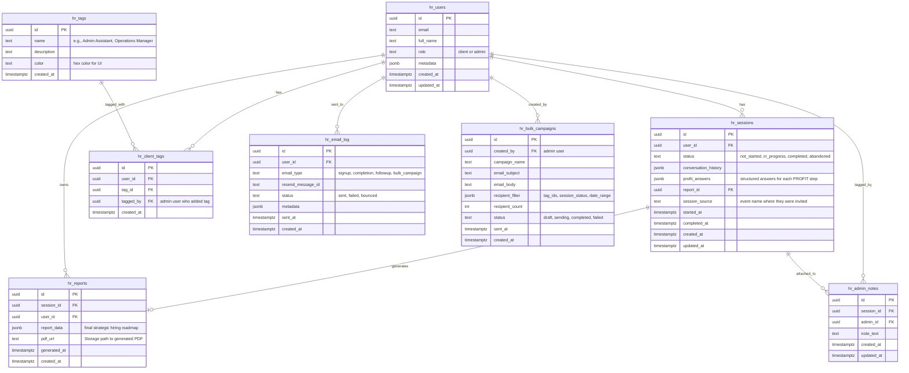

# HireRight Architecture Document

## Section 1: Project Overview

**Project name:** HireRight  
**Slug prefix:** `hr`

**Summary:**  
HireRight is a strategic hiring clarity platform that guides service business founders (<50 employees) through a conversational discovery process using the PROFIT method. The app replicates the founder's in-person consulting approach, helping clients move from "I need help" to "I need THIS specific role for THESE strategic reasons." It serves as the digital front door to the founder's staffing agency, positioning strategic discovery as a pre-step to agency engagement.

**Architecture type:** Dashboard/SaaS (hybrid)  
**Rationale:** The application serves two distinct user experiences:
1. **Client-facing:** Conversational AI-driven discovery with educational content (public landing → authenticated tool)
2. **Admin-facing:** Full CRM-style dashboard for managing sessions, tagging clients, bulk operations, and follow-up orchestration

This dual-surface architecture (public educational content + authenticated app + admin panel) fits the Dashboard/SaaS pattern. It's not purely chat-centric because it includes comprehensive CRUD operations, analytics, and bulk management features. It's not headless because the UI is central to both user experiences.

**Target user profile:**
- **Clients:** Non-technical service business founders (single decision-maker per company account) navigating business model transitions
- **Admins:** Founder + small team requiring full visibility across all client sessions, with annotation and segmentation capabilities

**External system connections:**
- **Outbound:** Anthropic Claude API (AI conversation orchestration for PROFIT discovery)
- **Outbound:** Resend API (transactional emails: signup confirmation, session completion, report delivery, password reset, follow-up sequences)
- **Outbound:** Stripe API (future: payment processing for freemium model, not Phase 1)
- **Outbound:** Calendly API (future: embedded scheduling, not Phase 1 — initial implementation uses direct links)
- **Inbound:** None (no webhooks in Phase 1)

---

## Section 2: Technology Stack

| Layer | Technology | Version | Rationale |
|-------|-----------|---------|-----------|
| Frontend Framework | Next.js | 15.x (as of 2024-12) | App Router with React Server Components for SEO-critical educational content + client-side interactivity for AI chat. Avoids Next 16 (breaks React 19 patterns). Node 20+ required (18 deprecated on Vercel). |
| Session Management | @supabase/ssr | 0.5.x (as of 2024-12) | **MANDATORY** for Next.js. Cookie-based session that middleware can read. Never use `@supabase/supabase-js` `createClient` in browser — it uses localStorage which middleware cannot access. Pin alongside `@supabase/supabase-js` 2.x. |
| UI Components | shadcn/ui (Radix) | Latest (as of 2024-12) | Accessible primitives with Tailwind styling. Provides form components, dialogs, dropdowns needed for admin panel and client forms. |
| Styling | Tailwind CSS | 3.4.x (as of 2024-12) | **Not v4** — Tailwind v4's Rust binary (`tailwindcss-oxide`) is blocked by Windows AppLocker/WDAC. Default to v3 unless v4 features explicitly required and dev environment permits binary. |
| Auth | Supabase Auth | Latest (as of 2024-12) | Email/password authentication with email confirmation. Manages JWT issuance, refresh, and session lifecycle. |
| Database | Supabase Postgres | Latest (as of 2024-12) | Stores all client data (accounts, sessions, PROFIT answers, reports, admin notes, tags). RLS enforces row-level isolation between clients. |
| Edge Functions | Supabase Edge Functions (Deno) | Latest (as of 2024-12) | Orchestrates Claude API calls, email delivery, and future payment processing. All external API calls originate here. |
| Storage | Supabase Storage | Latest (as of 2024-12) | Stores generated PDF reports and optional uploaded workbooks (Phase 3 offline mode). |
| LLM Provider | Anthropic Claude | `claude-sonnet-4` (as of 2024-12) | **Use family alias, NOT dated snapshot** (e.g., NOT `claude-3-5-sonnet-20241022` — dated snapshots get deprecated and silently 404). Excellent at multi-turn strategic conversations with nuanced follow-ups. Fallback: `claude-haiku-3-5` (faster, cheaper, lower quality). |
| Email Provider | Resend | API v1 (as of 2024-12) | Transactional email delivery. Simple API, high deliverability, built-in template support. Alternative: Postmark (similar feature set). |
| Payment Provider | Stripe | API 2024-11-20 (as of 2024-12) | Future Phase 5 freemium paywall. Handles one-time payments and subscriptions. Already in stack so freemium activation is config-only. |
| Deployment (Frontend) | Vercel | Latest (as of 2024-12) | Zero-config Next.js deployment with edge network, preview URLs for PRs, automatic HTTPS. Alternative: Netlify. |
| Deployment (Database/Functions) | Supabase Cloud | Latest (as of 2024-12) | Managed Postgres + Edge Functions runtime. us-east-1 region recommended (lowest latency for US-based users). |

**Known bad combinations to avoid:**
- Tailwind v4 + Windows enterprise environments (binary blocked)
- Node 18 (deprecated on Vercel — use 20+)
- Next 16 (breaks several React 19 patterns — use 15.x)
- Dated LLM snapshots (e.g., `claude-3-5-sonnet-20241022`) — use family aliases

---

## Section 3: Project Structure

```
/
├── src/
│   ├── app/                        ← PRESENTATION LAYER (Next.js App Router)
│   │   ├── CLAUDE.md                 ← Presentation rules for agents editing routes
│   │   ├── (public)/                 ← public routes (no auth required)
│   │   │   ├── page.tsx              ← landing page with PROFIT education
│   │   │   ├── about/
│   │   │   ├── method/               ← detailed PROFIT methodology
│   │   │   └── privacy/
│   │   ├── (auth)/                   ← authentication routes
│   │   │   ├── login/
│   │   │   ├── signup/
│   │   │   ├── forgot-password/
│   │   │   ├── reset-password/
│   │   │   └── callback/
│   │   ├── (client)/                 ← client-authenticated routes
│   │   │   ├── dashboard/
│   │   │   ├── discovery/            ← PROFIT AI conversation
│   │   │   ├── reports/              ← view past session reports
│   │   │   ├── settings/
│   │   │   └── layout.tsx            ← client nav wrapper
│   │   ├── (admin)/                  ← admin-authenticated routes
│   │   │   ├── admin/
│   │   │   │   ├── dashboard/
│   │   │   │   ├── sessions/         ← all client sessions
│   │   │   │   ├── clients/          ← client list with tags
│   │   │   │   ├── analytics/
│   │   │   │   ├── bulk-actions/
│   │   │   │   └── settings/
│   │   │   └── layout.tsx            ← admin nav wrapper
│   │   ├── api/
│   │   │   └── auth/
│   │   │       └── signout/
│   │   │           └── route.ts      ← explicit signout handler
│   │   ├── layout.tsx
│   │   ├── globals.css
│   │   └── middleware.ts             ← auth + session refresh
│   ├── components/                 ← PRESENTATION LAYER (UI primitives)
│   │   ├── CLAUDE.md                 ← No DB calls, no Supabase imports
│   │   ├── ui/                       ← shadcn/base components
│   │   │   ├── button.tsx
│   │   │   ├── input.tsx
│   │   │   ├── dialog.tsx
│   │   │   ├── card.tsx
│   │   │   ├── table.tsx
│   │   │   └── ...
│   │   ├── client/                   ← client-specific feature components
│   │   │   ├── profit-chat.tsx
│   │   │   ├── session-progress.tsx
│   │   │   ├── report-viewer.tsx
│   │   │   └── ...
│   │   └── admin/                    ← admin-specific feature components
│   │       ├── session-list.tsx
│   │       ├── client-tags.tsx
│   │       ├── bulk-action-modal.tsx
│   │       └── ...
│   ├── lib/
│   │   ├── supabase/               ← Supabase client factories (used ONLY by lib/services)
│   │   │   ├── CLAUDE.md             ← Only lib/services imports these
│   │   │   ├── client.ts             ← browser client (@supabase/ssr, anon key)
│   │   │   ├── server.ts             ← server client (@supabase/ssr, cookies)
│   │   │   └── middleware.ts         ← middleware client for session refresh
│   │   ├── services/               ← SERVICE LAYER — business logic + DB access
│   │   │   ├── CLAUDE.md             ← ONLY place `supabase.from(...)` appears
│   │   │   ├── clients.ts            ← client account CRUD
│   │   │   ├── sessions.ts           ← PROFIT session CRUD
│   │   │   ├── reports.ts            ← report generation + retrieval
│   │   │   ├── tags.ts               ← tagging + segmentation
│   │   │   ├── notes.ts              ← admin notes CRUD
│   │   │   ├── analytics.ts          ← aggregated metrics
│   │   │   └── bulk.ts               ← bulk operations (export, email campaigns)
│   │   ├── apiClient.ts            ← wrapper for invoking edge functions from Service layer
│   │   ├── constants.ts            ← PROFIT steps, role types, etc.
│   │   └── utils.ts
│   └── types/
│       ├── database.ts             ← generated from Supabase schema
│       ├── profit.ts               ← PROFIT method types
│       └── admin.ts                ← admin-specific types
├── supabase/
│   ├── migrations/
│   │   ├── CLAUDE.md                 ← Migration rules; never edit applied migrations
│   │   └── 001_initial_schema.sql    ← from seed SQL output
│   ├── functions/                  ← AGENT LAYER
│   │   ├── CLAUDE.md                 ← Middleware chain + CORS mandatory
│   │   ├── _shared/                  ← from security templates
│   │   │   ├── auth.ts
│   │   │   ├── rate-limit.ts
│   │   │   ├── cors.ts
│   │   │   ├── validate.ts
│   │   │   └── error-handler.ts
│   │   ├── hr_start_discovery/
│   │   │   └── index.ts              ← initiate PROFIT session
│   │   ├── hr_continue_discovery/
│   │   │   └── index.ts              ← multi-turn conversation with Claude
│   │   ├── hr_generate_report/
│   │   │   └── index.ts              ← finalize session, generate report
│   │   ├── hr_send_report_email/
│   │   │   └── index.ts              ← deliver report via Resend
│   │   ├── hr_send_followup/
│   │   │   └── index.ts              ← automated follow-up emails
│   │   └── hr_bulk_email/
│   │       └── index.ts              ← admin-triggered bulk campaigns
│   └── seed.sql
├── scripts/
│   ├── CLAUDE.md                   ← Local-only admin scripts; service_role allowed HERE ONLY
│   └── setup-integrations.md       ← credential setup for Claude, Resend, Stripe
├── tests/
│   ├── CLAUDE.md                   ← Abuse tests required before ship
│   └── abuse-test.ts               ← multi-client isolation tests
├── docs/
│   ├── architecture/
│   ├── deployment/
│   │   └── MANUAL_SQL_OPERATIONS.md
│   └── domain/
│       └── profit-method.md        ← detailed PROFIT methodology docs
├── .github/
│   └── workflows/
│       └── security-checks.yml     ← from security templates
├── .semgrep/
│   └── semgrep-rules.yml           ← from security templates
├── .env.example                    ← committed template (no real values)
├── .env.local                      ← local dev values, gitignored
├── .env.test                       ← test user credentials, gitignored
├── .env.test.example               ← committed template for test creds
├── .gitignore
├── CLAUDE.md                       ← Root contract
├── next.config.ts
├── tailwind.config.ts
├── tsconfig.json
├── package.json
└── README.md
```

### Next.js App Router: Hydration & Data-Access Rules

1. **Server Components by default.** Every file under `app/` is a Server Component unless it contains `"use client"` at the top. Only mark `"use client"` when needing browser APIs, event handlers, `useState`, `useEffect`, or Context.

2. **Data fetching happens in Server Components** via the Service layer. Server Components call `import { getXyz } from '@/lib/services/[domain]'` and `await` the result. Client Components receive data as props or call Service functions through Server Actions or via `apiClient`.

3. **No Supabase client imports in Client Components.** Client Components never import from `@/lib/supabase/*`. They call Service functions only.

4. **No `Date.now()`, `Math.random()`, or `new Date()` in render paths** of Server Components that render the same HTML the client will hydrate. Pass timestamps in from server response or compute in Client Component.

5. **`suppressHydrationWarning` is forbidden** as a general fix. Locate offending dynamic value and move to Client Component or pass as stable prop.

6. **`cookies()`, `headers()`, and `auth.getUser()` are server-only.** Call only in Server Components, Route Handlers, or Server Actions. Client Components cannot read these directly.

7. **Dynamic routes with `params`/`searchParams`** must be `await`ed in Next.js 15+ (`const { id } = await params;`). Do not destructure synchronously.

8. **Streaming / `Suspense` boundaries** required around Server Components fetching data for long-running calls (>200ms typical). Provide skeleton fallback via `<Suspense fallback={<Skeleton/>}>`.

9. **Revalidation** on mutations uses `revalidatePath` / `revalidateTag` from Server Action. Never invalidate cached data from client.

10. **Middleware / `middleware.ts`** handles auth redirects and cookie refresh only. It does not fetch domain data.

---

## Section 4: Data Model

### Entity Relationship Diagram



### Table Descriptions

**hr_users**
- Purpose: User accounts for both clients and admins
- User Stories: All — foundational authentication and profile data
- External Data: None
- Notes: `role` field differentiates client vs admin access. Single account per founder (multi-isolated tenancy).

**hr_sessions**
- Purpose: Tracks each PROFIT discovery conversation
- User Stories: US-001 (complete discovery), US-002 (multi-session support), US-009 (save/resume)
- External Data: `conversation_history` stores Claude API message array for resume/context
- Notes: `conversation_history` is full JSON array of messages exchanged with Claude. `profit_answers` is structured extraction of their responses to P-R-O-F-I-T questions.

**hr_reports**
- Purpose: Generated strategic hiring roadmaps
- User Stories: US-001 (receive report), US-003 (view history), US-008 (in-app delivery)
- External Data: `report_data` may include Claude-generated recommendations; `pdf_url` points to Storage
- Notes: Auto-generated on session completion. PDF stored in Supabase Storage `hr_reports` bucket.

**hr_tags**
- Purpose: Categorization labels for clients (role type, hiring status, etc.)
- User Stories: US-012 (admin tagging), US-013 (bulk actions by tag)
- External Data: None
- Notes: Admin-curated. Examples: "Admin Assistant," "Fractional CFO," "Converted to Agency."

**hr_client_tags**
- Purpose: Many-to-many relationship between clients and tags
- User Stories: US-012 (admin tagging), US-013 (bulk actions)
- External Data: None
- Notes: Tracks who applied the tag and when for audit.

**hr_admin_notes**
- Purpose: Internal notes admins add to client sessions
- User Stories: US-011 (admin notes)
- External Data: None
- Notes: Only visible to admins. Used for follow-up context, sales notes, etc.

**hr_email_log**
- Purpose: Audit trail of all emails sent
- User Stories: US-004 (automated emails), US-014 (bulk campaigns)
- External Data: `resend_message_id` from Resend API for delivery tracking
- Notes: Used for deliverability debugging and compliance.

**hr_bulk_campaigns**
- Purpose: Admin-initiated bulk email campaigns
- User Stories: US-013 (bulk actions), US-014 (bulk email)
- External Data: None
- Notes: `recipient_filter` stores JSON query (tag IDs, session status, date range). Links to individual `hr_email_log` rows for tracking.

### Lookup / Config Tables

None. All data is user-scoped or admin-scoped. No shared lookup data in Phase 1.

---

## Section 5: Auth Flow

```
1. User opens app at https://hireright.app
2. Client initializes Supabase with NEXT_PUBLIC_SUPABASE_ANON_KEY (@supabase/ssr client.ts)
3. User signs up via email/password or signs in
4. Supabase Auth returns JWT containing user.id and role claim (set via trigger on signup)
5. Session cookie stored via @supabase/ssr (NOT localStorage)
6. Middleware on every request:
   - Calls updateSession() from @/lib/supabase/middleware
   - Refreshes session cookie by calling supabase.auth.getUser()
   - Redirects unauthenticated users to /login (except exempt routes)
   - Redirects authenticated users away from /login to their appropriate dashboard
7. For direct DB queries: PostgREST extracts auth.uid() from JWT → RLS filters rows
8. For edge functions: requireAuth() extracts user from JWT → createUserClient() scopes queries
9. On token expiry: Supabase JS auto-refreshes using refresh token (via middleware)
10. On logout: 
    - User clicks logout
    - POST /api/auth/signout handler:
      a. Calls supabase.auth.signOut()
      b. Iterates cookies() and explicitly deletes every sb-* cookie
      c. Redirects to /login
```

**Auth providers enabled:**
- Email/password (primary)
- Magic link (Phase 2 consideration)
- OAuth providers: None in Phase 1

**Signup:**
- Open signup (not disabled)
- Email confirmation required in production (email verification link sent)
- Development: Email confirmation bypassed for local testing

**JWT expiry:**
- Access token: 1 hour (default)
- Refresh token: 30 days (default)
- Middleware refreshes on every request, so effective session is indefinite while user is active

**Email confirmation:**
- Production: Required (Supabase Auth sends verification email via Resend)
- Development: Optional (can be disabled in Supabase Dashboard for local testing)

### Session Cookie Lifecycle

- **Middleware refreshes the session cookie on every request.** The `updateSession()` helper from `@/lib/supabase/middleware` calls `supabase.auth.getUser()` between client construction and the response — this triggers cookie rotation. Without this, signed-in users appear signed out after access token TTL.

- **Browser reads cookies, not localStorage.** All browser code goes through `createClient()` from `@/lib/supabase/client.ts` (cookie-backed via `@supabase/ssr`). Importing `createClient` from `@supabase/supabase-js` directly is forbidden (caught by layer boundary script).

- **Signout clears cookies explicitly.** The `/api/auth/signout` POST handler calls `supabase.auth.signOut()` AND iterates `cookies()` deleting every `sb-*` cookie before redirecting. Calling `auth.signOut()` alone does not clear cookies in all environments.

- **Signout is exempt from auth-redirect middleware.** The middleware matcher excludes `/api/auth/signout`. Otherwise signout response gets re-redirected back into protected route and cookie clear races.

### Middleware Route Matrix

| Route prefix | Auth required | Unauth behavior | Notes |
|---|---|---|---|
| `/`, `/about`, `/method`, `/privacy` | No | Allow | Public educational content |
| `/login`, `/signup`, `/forgot-password`, `/reset-password` | No | Allow | Authenticated users redirect to their dashboard (client → /dashboard, admin → /admin/dashboard) |
| `/auth/callback` | No | Allow | Supabase redirects here after email verification |
| `/api/auth/signout` | No | Allow | EXEMPT from auth check (mandatory matcher exclusion) |
| `/_next/*`, `/favicon.ico`, static assets | No | Allow | Skip middleware via matcher |
| `/dashboard/*`, `/discovery/*`, `/reports/*`, `/settings/*` | Yes | Redirect to `/login?next=<path>` | Client-authenticated routes |
| `/admin/*` | Yes (admin role) | Redirect to `/login` or `/dashboard` if non-admin | Admin-only routes; role check in middleware |
| All other routes | Yes | Redirect to `/login?next=<path>` | Default-deny |

**Role-based routing:**
- After successful login, middleware checks `user.role` (from JWT claim or metadata)
- If `role === 'admin'`, redirect to `/admin/dashboard`
- If `role === 'client'`, redirect to `/dashboard`
- Clients attempting to access `/admin/*` get redirected to `/dashboard`
- Admins can access both `/admin/*` and `/dashboard/*` (view as client)

---

## Section 6: External Integration Architecture

### Anthropic Claude API

**Integration summary:**

| Field | Value |
|-------|-------|
| Direction | Outbound |
| Trigger | User action (client submits PROFIT discovery question) |
| Auth method | API Key (Bearer token) |
| Called from | `hr_continue_discovery`, `hr_generate_report` edge functions |
| Credential(s) | `ANTHROPIC_API_KEY` (Supabase Vault) |
| Rate limit | Per-model limits (Claude Sonnet: generous, no explicit rate limit documented; implement exponential backoff on 429) |

**Request path:**
```
Edge Function (hr_continue_discovery or hr_generate_report)
  → fetch(https://api.anthropic.com/v1/messages)
    Headers: 
      x-api-key: ${Deno.env.get("ANTHROPIC_API_KEY")}
      anthropic-version: 2023-06-01
      content-type: application/json
    Body: {
      model: "claude-sonnet-4",
      max_tokens: 2048,
      messages: [
        { role: "user", content: "<conversation_history>" },
        { role: "assistant", content: "<previous_responses>" },
        { role: "user", content: "<new_user_input>" }
      ],
      system: "<PROFIT_METHOD_PROMPT>"
    }
  ← Response: {
    id: "msg_...",
    type: "message",
    role: "assistant",
    content: [{ type: "text", text: "..." }],
    model: "claude-sonnet-4",
    stop_reason: "end_turn",
    usage: { input_tokens: X, output_tokens: Y }
  }
  → Parse content[0].text and store in hr_sessions.conversation_history
  → Extract structured PROFIT answers and store in hr_sessions.profit_answers
```

**Webhook path:** Not applicable (outbound only)

**Failure handling:**
- On 401: Log with error code, return sanitized error to user: "AI service unavailable — please try again later"
- On 429: Retry with exponential backoff (1s, 2s, 4s), max 3 attempts, then fail gracefully
- On 5xx: Log with service name (`anthropic`), status code, timestamp — return sanitized error: "AI service temporarily down — your progress is saved, please retry"
- On timeout (>30s): Cancel request, return error: "Response took too long — please try again"
- On processing failure after successful API call: Session saved with `in_progress` status preserved, conversation_history includes failed exchange — client can retry from that point

**Fallback model:**
- Primary: `claude-sonnet-4` (best reasoning, strategic conversation quality)
- Fallback: `claude-haiku-3-5` (faster, cheaper, lower quality)
- Trigger: If Sonnet returns 503 or timeout, retry once with Haiku
- User visibility: Loading state shows "Getting your strategic insights..." (no model name exposed)

**Credential setup:** See `scripts/setup-integrations.md`

---

### Resend API

**Integration summary:**

| Field | Value |
|-------|-------|
| Direction | Outbound |
| Trigger | User action (signup, session completion) OR automated (follow-up sequences) OR admin action (bulk campaigns) |
| Auth method | API Key (Bearer token) |
| Called from | `hr_send_report_email`, `hr_send_followup`, `hr_bulk_email` edge functions |
| Credential(s) | `RESEND_API_KEY` (Supabase Vault) |
| Rate limit | 100 emails/second (free tier: 3,000/month, paid tier scales) — no retry on rate limit, queue internally |

**Request path:**
```
Edge Function (hr_send_report_email, hr_send_followup, or hr_bulk_email)
  → fetch(https://api.resend.com/emails)
    Headers: 
      Authorization: Bearer ${Deno.env.get("RESEND_API_KEY")}
      Content-Type: application/json
    Body: {
      from: "HireRight <noreply@hireright.app>",
      to: ["user@example.com"],
      subject: "Your Strategic Hiring Roadmap is Ready",
      html: "<email_template_html>",
      reply_to: "tanika@hireright.app",
      attachments: [
        {
          filename: "hiring-roadmap.pdf",
          content: "<base64_pdf_content>"
        }
      ]
    }
  ← Response: {
    id: "re_...",
    from: "noreply@hireright.app",
    to: ["user@example.com"],
    created_at: "2024-12-15T10:30:00Z"
  }
  → Store Resend message ID in hr_email_log.resend_message_id
  → Update hr_email_log.status to "sent"
```

**Webhook path (future Phase 2 consideration):**
```
Resend webhook (delivery status, bounces, complaints)
  → POST /functions/v1/hr_resend_webhook
    Headers: svix-id, svix-timestamp, svix-signature (HMAC verification)
    Body: {
      type: "email.delivered" | "email.bounced" | "email.complained",
      data: {
        email_id: "re_...",
        to: "user@example.com",
        timestamp: "..."
      }
    }
  → Edge function validates HMAC signature using RESEND_WEBHOOK_SECRET
  → Updates hr_email_log.status based on event type
  → If bounced/complained: flag user for follow-up, possibly pause automated emails
```

**Failure handling:**
- On 401: Log error, alert admin (email credentials invalid — critical)
- On 429: Do NOT retry immediately (hitting rate limit) — queue email for batch send 1 minute later
- On 5xx: Retry with exponential backoff (5s, 10s, 20s), max 3 attempts, then log failure
- On validation error (422): Log full error response (likely bad email format or missing field), surface to admin
- On send failure: Record in `hr_email_log` with `status = 'failed'`, include error message in metadata — admin dashboard shows failed sends for manual retry

**Email types and templates:**

| Type | Trigger | From | Subject | Includes Attachment |
|------|---------|------|---------|---------------------|
| signup | User creates account | noreply@hireright.app | Welcome to HireRight | No |
| email_verification | Supabase Auth sends (via Resend SMTP) | noreply@hireright.app | Confirm your email | No |
| session_completion | `hr_generate_report` completes | noreply@hireright.app | Your Strategic Hiring Roadmap is Ready | Yes (PDF) |
| password_reset | User requests password reset | noreply@hireright.app | Reset your HireRight password | No |
| followup_day1 | 24 hours after completion | noreply@hireright.app | Quick follow-up: Next steps for your hire | No |
| followup_day3 | 72 hours after completion | noreply@hireright.app | Still thinking it through? | No |
| followup_abandoned | 24 hours after session start without completion | noreply@hireright.app | You're almost there — finish your roadmap | No |
| bulk_campaign | Admin triggers | noreply@hireright.app | <custom_subject> | Optional |

**Credential setup:** See `scripts/setup-integrations.md`

---

### Stripe API (Phase 5 — Future)

**Integration summary:**

| Field | Value |
|-------|-------|
| Direction | Outbound (API calls) + Inbound (webhooks) |
| Trigger | User clicks "Upgrade" or creates additional session beyond free tier |
| Auth method | API Key (Bearer token) |
| Called from | `hr_create_checkout`, `hr_stripe_webhook` edge functions |
| Credential(s) | `STRIPE_SECRET_KEY`, `STRIPE_WEBHOOK_SECRET` (Supabase Vault) |
| Rate limit | 100 requests/second (automatic retry by Stripe SDK on rate limit) |

**Request path (checkout session creation):**
```
Edge Function (hr_create_checkout)
  → fetch(https://api.stripe.com/v1/checkout/sessions)
    Headers: 
      Authorization: Bearer ${Deno.env.get("STRIPE_SECRET_KEY")}
      Content-Type: application/x-www-form-urlencoded
    Body (form-encoded): {
      customer_email: "user@example.com",
      payment_method_types: ["card"],
      line_items: [{
        price: "price_...",  // Stripe Price ID
        quantity: 1
      }],
      mode: "payment",  // or "subscription"
      success_url: "https://hireright.app/payment/success?session_id={CHECKOUT_SESSION_ID}",
      cancel_url: "https://hireright.app/payment/cancel",
      metadata: {
        user_id: "uuid",
        session_count: "2"  // which session triggered payment
      }
    }
  ← Response: {
    id: "cs_...",
    url: "https://checkout.stripe.com/pay/cs_...",
    payment_status: "unpaid"
  }
  → Return checkout URL to client for redirect
```

**Webhook path (payment confirmation):**
```
Stripe webhook
  → POST /functions/v1/hr_stripe_webhook
    Headers: stripe-signature (HMAC verification)
    Body: {
      id: "evt_...",
      type: "checkout.session.completed",
      data: {
        object: {
          id: "cs_...",
          payment_status: "paid",
          metadata: { user_id: "...", session_count: "2" }
        }
      }
    }
  → Edge function validates signature using STRIPE_WEBHOOK_SECRET
  → Extracts user_id from metadata
  → Updates hr_users.metadata to mark payment received
  → Unlocks additional session creation for user
```

**Failure handling:**
- On 401: Log error, alert admin (Stripe credentials invalid — critical)
- On 429: Automatic retry by Stripe SDK
- On 5xx: Retry with exponential backoff, max 3 attempts
- On webhook signature mismatch: Reject with 401 (prevents spoofed webhooks)
- On payment failure: User sees Stripe's error message in checkout flow — no custom handling needed
- On webhook processing failure: Log error, queue for manual review — do NOT unlock feature until payment confirmed

**Credential setup:** See `scripts/setup-integrations.md` (Phase 5 only)

---

### Calendly API (Phase 3+ — Future)

**Integration summary:**

| Field | Value |
|-------|-------|
| Direction | Outbound (embed scheduling link) — no API integration in Phase 1 |
| Trigger | User clicks "Book a Call" CTA |
| Auth method | Not applicable (uses public embed link) |
| Called from | Client-side component (iframe embed) |
| Credential(s) | None (public Calendly link) |
| Rate limit | Not applicable |

**Phase 1 Implementation:**
- Direct link to Calendly event URL: `https://calendly.com/tanika-hot/debrief`
- No API integration required
- User clicks link → opens Calendly in new tab → books directly

**Phase 3+ Future Enhancement:**
```
Edge Function (hr_create_calendly_invite) — not in Phase 1
  → fetch(https://api.calendly.com/scheduled_events)
    Headers: 
      Authorization: Bearer ${Deno.env.get("CALENDLY_ACCESS_TOKEN")}
    Body: {
      event_type_uuid: "...",
      invitee_email: "user@example.com",
      ...
    }
  ← Response: { scheduled_event_url: "..." }
  → Return URL to client for direct booking
```

**Credential setup:** See `scripts/setup-integrations.md` (Phase 3+ only)

---

## Section 7: Data Flow Diagrams

### User Action: Sign Up

```
Client (browser)
  → POST /auth/v1/signup (Supabase Auth endpoint)
    Body: { email: "user@example.com", password: "..." }
  → Supabase Auth:
    1. Creates auth.users row
    2. Triggers database function create_user_profile()
       → Inserts hr_users row with user.id, email, role = 'client'
    3. Sends email verification link via Resend
  ← 200 OK { user: { id: "...", email: "..." }, session: null }
  → Client redirects to /check-email page
  → User clicks verification link in email
  → GET /auth/callback?token=...
    → Supabase Auth verifies token, confirms email
    → Sets session cookie via @supabase/ssr
    → Redirects to /dashboard
```

---

### User Action: Start PROFIT Discovery

```
Client (browser)
  → POST /functions/v1/hr_start_discovery
    Headers: Authorization: Bearer <jwt>
    Body: { session_source: "TechSummit 2024" }
  → Edge Function: hr_start_discovery/index.ts
    1. handlePreflight(req) → pass
    2. requireAuth(req) → { id: "uuid", email: "..." }
    3. rateLimit(user.id, "hr_start_discovery", "write") → { allowed: true }
    4. validateBody(req, startDiscoverySchema) → { session_source: "..." }
    5. createUserClient(req) → scoped Supabase client
    6. Check if user already has in_progress session:
       supabase.from("hr_sessions")
         .select("id, status")
         .eq("user_id", user.id)
         .in("status", ["not_started", "in_progress"])
         .single()
       → If exists: return 409 "You have an unfinished session — continue it?"
    7. Create new session:
       supabase.from("hr_sessions").insert({
         user_id: user.id,
         status: "not_started",
         session_source: req.session_source,
         conversation_history: [],
         profit_answers: { P: null, R: null, O: null, F: null, I: null }
       }).select()
       → RLS: WITH CHECK (user_id = auth.uid()) → pass
    8. Return { data: { session_id: "uuid", first_question: "Tell me about your business..." } }
  ← 201 Created
```

---

### User Action: Continue Discovery (Multi-turn Conversation)

```
Client (browser)
  → POST /functions/v1/hr_continue_discovery
    Headers: Authorization: Bearer <jwt>
    Body: { 
      session_id: "uuid",
      user_message: "We're transitioning from consulting to coaching..."
    }
  → Edge Function: hr_continue_discovery/index.ts
    1. Middleware chain (preflight, auth, rate limit, validate)
    2. createUserClient(req)
    3. Fetch session:
       supabase.from("hr_sessions")
         .select("*")
         .eq("id", session_id)
         .eq("user_id", user.id)  // RLS enforces, but explicit for clarity
         .single()
       → RLS: (user_id = auth.uid()) → pass
       → If not found or user_id mismatch: 404
    4. Check status: if "completed", return 400 "Session already completed"
    5. Build Claude API request:
       - messages: session.conversation_history + new user_message
       - system: PROFIT_METHOD_PROMPT (guides conversation through P→R→O→F→I)
    6. fetch(https://api.anthropic.com/v1/messages)
       → On 401: return 502 "AI service unavailable"
       → On 429: exponential backoff (1s, 2s, 4s), max 3 attempts
       → On 5xx: return 502 "AI temporarily down — progress saved, retry"
       → On success: parse content[0].text
    7. Append exchange to conversation_history:
       supabase.from("hr_sessions").update({
         conversation_history: [...old_history, user_msg, assistant_msg],
         profit_answers: extract_profit_data(conversation_history),
         status: "in_progress",
         updated_at: now()
       }).eq("id", session_id)
    8. Determine next step:
       - If all PROFIT steps answered: return { done: true, next_action: "generate_report" }
       - Else: return { done: false, assistant_message: "...", progress: "40%" }
  ← 200 OK
```

**Idempotency:**
- NOT applicable here (conversations are inherently sequential, not idempotent)
- If user retries same message, Claude generates different response — this is expected behavior
- Session state preserved on every update, so retry-after-failure resumes correctly

---

### User Action: Complete Discovery & Generate Report

```
Client (browser)
  → POST /functions/v1/hr_generate_report
    Headers: Authorization: Bearer <jwt>
    Body: { session_id: "uuid" }
  → Edge Function: hr_generate_report/index.ts
    1. Middleware chain
    2. createUserClient(req)
    3. Fetch session (same RLS enforcement as continue_discovery)
    4. Validate status: must be "in_progress" with all PROFIT steps answered
    5. Call Claude API with synthesis prompt:
       - messages: full conversation_history
       - system: "Synthesize the PROFIT answers into a strategic hiring roadmap..."
    6. Parse Claude response into structured report_data (JSON):
       {
         executive_summary: "...",
         current_state: "...",
         strategic_goals: "...",
         team_gaps: ["...", "..."],
         recommended_role: {
           title: "...",
           responsibilities: ["...", "..."],
           required_skills: ["...", "..."],
           budget_guidance: "..."
         },
         next_steps: ["...", "..."]
       }
    7. Generate PDF (future: use library like Puppeteer or PDFKit):
       - Render HTML template with report_data
       - Convert to PDF buffer
       - Upload to Supabase Storage hr_reports bucket:
         supabase.storage.from("hr_reports")
           .upload(`${user.id}/${session_id}.pdf`, pdfBuffer)
       → Returns { path: "user_id/session_id.pdf" }
    8. Create report record:
       supabase.from("hr_reports").insert({
         session_id: session_id,
         user_id: user.id,
         report_data: report_data,
         pdf_url: storage_path,
         generated_at: now()
       }).select()
    9. Update session status:
       supabase.from("hr_sessions").update({
         status: "completed",
         completed_at: now(),
         report_id: report_id
       }).eq("id", session_id)
    10. Trigger email delivery (call hr_send_report_email):
        Internal function call or separate edge function invocation
    11. Return { data: { report_id: "uuid", pdf_url: "signed_url", report_data: {...} } }
  ← 200 OK
```

**Idempotency:**
- REQUIRED for this function (long-running LLM synthesis + PDF generation)
- Call `checkIdempotency` from `_shared/idempotency.ts`:
  ```typescript
  const idempotencyCheck = await checkIdempotency(userClient, {
    table: "hr_sessions",
    recordId: session_id,
    inProgressStates: ["generating_report"],
    completedStates: ["completed"],
    resultColumn: "report_id"
  });

  if (idempotencyCheck.kind === "completed") {
    // Return the existing report (fetch from hr_reports)
    const report = await userClient.from("hr_reports")
      .select("*")
      .eq("id", idempotencyCheck.resultValue)
      .single();
    return new Response(JSON.stringify({ data: report.data }), { status: 200, headers });
  }

  if (idempotencyCheck.kind === "in_progress") {
    return safeError(req, 409, "Report generation already in progress, please retry in 10 seconds");
  }

  // kind === "not_started" → proceed with generation
  // First action: transition status to "generating_report"
  await userClient.from("hr_sessions")
    .update({ status: "generating_report" })
    .eq("id", session_id);

  // ... then proceed with Claude API call, PDF gen, etc.
  ```

**On processing failure after storage:**
- PDF upload succeeds, but report record insert fails:
  - Session status remains "in_progress"
  - PDF exists in Storage but is orphaned
  - User can retry → idempotency check will see "in_progress" → return 409
  - Manual cleanup: admin script to delete orphaned PDFs
- Report created, but email send fails:
  - Report exists, user can access via in-app viewer
  - Email logged as "failed" in hr_email_log
  - Automated retry: cron job checks hr_email_log for failed sends, retries after 1 hour

---

### User Action: View Report (In-App)

```
Client (browser)
  → GET /reports/[report_id] (Next.js page)
  → Server Component fetches data:
    import { getReport } from '@/lib/services/reports'
    const report = await getReport(report_id)
  → Service Layer (services/reports.ts):
    const supabase = createServerClient()
    const { data, error } = await supabase
      .from("hr_reports")
      .select("*, hr_sessions!inner(*)")
      .eq("id", report_id)
      .single()
    → RLS: (user_id = auth.uid()) OR (EXISTS admin check)
    → If not found: return null (page shows 404)
  → Render report data in UI:
    - Executive summary
    - Strategic goals
    - Recommended role breakdown
    - Next steps checklist
  → Show "Download PDF" button → links to signed Storage URL:
    const { data: signedUrl } = await supabase.storage
      .from("hr_reports")
      .createSignedUrl(report.pdf_url, 3600)  // 1 hour expiry
```

---

### Admin Action: Tag a Client

```
Admin (browser)
  → POST /api/clients/[user_id]/tags (Next.js Route Handler or Server Action)
    Body: { tag_id: "uuid" }
  → Server Action or Route Handler:
    const supabase = createServerClient()
    const { data: { user } } = await supabase.auth.getUser()
    if (user.role !== 'admin') return { error: 'Unauthorized' }
    
    const { data, error } = await supabase
      .from("hr_client_tags")
      .insert({
        user_id: req.user_id,
        tag_id: req.tag_id,
        tagged_by: user.id
      })
    → RLS: (tagged_by IN (SELECT id FROM hr_users WHERE role = 'admin'))
    → If already tagged: return 409 "Tag already applied"
  ← 201 Created
  → Client UI updates tag list, revalidates page
```

---

### Admin Action: Bulk Email Campaign

```
Admin (browser)
  → POST /functions/v1/hr_bulk_email
    Headers: Authorization: Bearer <jwt>
    Body: {
      campaign_name: "Admin Assistant Resources",
      email_subject: "Tools for your new hire",
      email_body: "<html>...</html>",
      recipient_filter: {
        tag_ids: ["uuid"],
        session_status: "completed",
        date_range: { after: "2024-01-01", before: "2024-12-31" }
      }
    }
  → Edge Function: hr_bulk_email/index.ts
    1. Middleware chain (auth requires admin role check)
    2. requireAuth(req) → { id: "...", role: "admin" }
       → If role !== 'admin': return 403
    3. rateLimit(user.id, "hr_bulk_email", "admin") → tier: 10/hour
    4. validateBody(req, bulkEmailSchema)
    5. createUserClient(req) with admin privileges
    6. Build recipient query:
       let query = supabase
         .from("hr_users")
         .select("id, email")
         .neq("role", "admin");  // don't email admins
       
       if (filter.tag_ids) {
         query = query.in("id", (
           supabase.from("hr_client_tags")
             .select("user_id")
             .in("tag_id", filter.tag_ids)
         ));
       }
       if (filter.session_status) {
         query = query.in("id", (
           supabase.from("hr_sessions")
             .select("user_id")
             .eq("status", filter.session_status)
         ));
       }
       // date_range filter on hr_sessions.completed_at...
       
       const { data: recipients } = await query;
    7. Create campaign record:
       const { data: campaign } = await supabase
         .from("hr_bulk_campaigns")
         .insert({
           created_by: user.id,
           campaign_name: req.campaign_name,
           email_subject: req.email_subject,
           email_body: req.email_body,
           recipient_filter: req.recipient_filter,
           recipient_count: recipients.length,
           status: "sending"
         })
         .select()
         .single();
    8. Send emails (batched to avoid Resend rate limit):
       for (const recipient of recipients) {
         const result = await fetch("https://api.resend.com/emails", {
           method: "POST",
           headers: {
             Authorization: `Bearer ${Deno.env.get("RESEND_API_KEY")}`,
             "Content-Type": "application/json"
           },
           body: JSON.stringify({
             from: "HireRight <noreply@hireright.app>",
             to: [recipient.email],
             subject: req.email_subject,
             html: req.email_body
           })
         });
         
         const resendData = await result.json();
         
         // Log each send
         await supabase.from("hr_email_log").insert({
           user_id: recipient.id,
           email_type: "bulk_campaign",
           resend_message_id: resendData.id,
           status: result.ok ? "sent" : "failed",
           metadata: { campaign_id: campaign.id }
         });
         
         // Rate limit: 100/sec, so batch every 10ms
         await new Promise(resolve => setTimeout(resolve, 10));
       }
    9. Update campaign status:
       await supabase.from("hr_bulk_campaigns")
         .update({ status: "completed", sent_at: now() })
         .eq("id", campaign.id);
    10. Return { data: { campaign_id: campaign.id, sent_count: recipients.length } }
  ← 200 OK
```

**On email send failure during bulk:**
- Each email failure logged individually in hr_email_log
- Campaign continues (doesn't fail entirely if one email bounces)
- Admin dashboard shows: "Sent 47/50 emails — 3 failed (view details)"
- Failed emails can be retried individually from admin panel

---

### Automated Follow-Up Email (Cron Trigger)

```
Supabase Cron (daily at 10am UTC)
  → Invoke hr_send_followup edge function with service_role key
  → Edge Function: hr_send_followup/index.ts
    1. Uses service_role client (no JWT required for cron)
    2. Query users needing follow-up:
       - Day 1 follow-up: completed_at = now() - 1 day
       - Day 3 follow-up: completed_at = now() - 3 days
       - Abandoned session: started_at = now() - 1 day AND status = 'in_progress'
    3. For each matched user:
       - Fetch session + user details
       - Determine follow-up type (day1, day3, abandoned)
       - Send via Resend (same pattern as bulk email)
       - Log in hr_email_log
    4. Return summary: { sent: 12, failed: 1 }
```

**Cron configuration (supabase/functions/hr_send_followup/cron.yml):**
```yaml
- name: hr_send_followup
  schedule: "0 10 * * *"  # daily at 10am UTC
```

---

## Section 8: Edge Function Inventory

| Function | Method | Rate Limit | Description | External Calls | Deployment flags |
|----------|--------|-----------|-------------|----------------|------------------|
| hr_start_discovery | POST | write | Initiates new PROFIT session for user | None | Default (JWT verification enabled) |
| hr_continue_discovery | POST | write | Multi-turn conversation with Claude | Anthropic Claude API | Default |
| hr_generate_report | POST | write | Finalizes session, generates strategic roadmap, creates PDF | Anthropic Claude API | Default; uses idempotency check |
| hr_send_report_email | POST | write | Delivers report via email (triggered internally) | Resend API | Default |
| hr_send_followup | POST | auth | Automated follow-up emails (cron-triggered) | Resend API | `--no-verify-jwt` (service_role invocation only) |
| hr_bulk_email | POST | admin (10/hour) | Admin bulk email campaigns | Resend API | Default; admin role check in function body |

### hr_start_discovery

**Input schema (Zod):**
```typescript
{
  session_source: z.string().optional()  // e.g., "TechSummit 2024"
}
```

**Tables accessed:**
- Read: `hr_sessions` (check for existing in_progress session)
- Write: `hr_sessions` (insert new session)

**External service calls:** None

**Success response (201):**
```json
{
  "data": {
    "session_id": "uuid",
    "first_question": "Tell me about your business and what's changing..."
  }
}
```

**Error cases:**
- 409: User already has in_progress session → "You have an unfinished session — continue it?"
- 401: Invalid or missing JWT → "Authentication required"
- 429: Rate limit exceeded → "Too many requests, please wait"
- 500: Database error → "Service temporarily unavailable"

**Deployment:**
```bash
supabase functions deploy hr_start_discovery
```

---

### hr_continue_discovery

**Input schema:**
```typescript
{
  session_id: z.string().uuid(),
  user_message: z.string().min(1)
}
```

**Tables accessed:**
- Read: `hr_sessions` (fetch conversation history)
- Write: `hr_sessions` (append new exchange, update profit_answers)

**External service calls:**
- **Anthropic Claude API** (POST /v1/messages)
  - On 401: Return 502 "AI service unavailable"
  - On 429: Retry with backoff (1s, 2s, 4s), max 3 attempts
  - On 5xx: Return 502 "AI temporarily down — progress saved"
  - On success: Parse assistant message and progress

**Success response (200):**
```json
{
  "data": {
    "assistant_message": "Thanks for sharing that. Let's dive into your team structure...",
    "progress": "40%",
    "done": false,
    "next_step": "R"
  }
}
```
OR if discovery complete:
```json
{
  "data": {
    "assistant_message": "Got it. You're ready for your strategic roadmap.",
    "progress": "100%",
    "done": true,
    "next_action": "generate_report"
  }
}
```

**Error cases:**
- 404: Session not found or user_id mismatch → "Session not found"
- 400: Session already completed → "Session already completed"
- 502: Claude API failure (after retries) → "AI temporarily down — progress saved, please retry"
- 401/429/500: Same as hr_start_discovery

**Deployment:**
```bash
supabase functions deploy hr_continue_discovery
```

---

### hr_generate_report

**Input schema:**
```typescript
{
  session_id: z.string().uuid()
}
```

**Tables accessed:**
- Read: `hr_sessions` (fetch full conversation + profit_answers)
- Write: `hr_sessions` (update status to "generating_report" then "completed")
- Write: `hr_reports` (insert final report)
- Write: Supabase Storage `hr_reports` bucket (upload PDF)

**External service calls:**
- **Anthropic Claude API** (synthesis prompt)
- **Resend API** (indirectly via hr_send_report_email call)

**Idempotency:**
- Uses `checkIdempotency` helper (see Section 7 flow)
- `inProgressStates: ["generating_report"]`
- `completedStates: ["completed"]`
- `resultColumn: "report_id"`
- On `kind === "completed"`: Return existing report
- On `kind === "in_progress"`: Return 409 with retry guidance

**Success response (200):**
```json
{
  "data": {
    "report_id": "uuid",
    "report_data": {
      "executive_summary": "...",
      "recommended_role": { ... },
      "next_steps": ["...", "..."]
    },
    "pdf_url": "https://[project].supabase.co/storage/v1/object/sign/hr_reports/...",
    "email_sent": true
  }
}
```

**Error cases:**
- 404: Session not found
- 400: Session not ready (missing PROFIT answers)
- 409: Report generation already in progress → "Report generation in progress, retry in 10 seconds"
- 502: Claude API failure
- 500: PDF generation or storage upload failure → "Report generation failed — please retry"

**On processing failure:**
- If PDF upload succeeds but report insert fails: Session stays "generating_report", retry will catch via idempotency (kind === "in_progress") → return 409
- If report created but email fails: Report exists, email logged as "failed", user can still view in-app

**Deployment:**
```bash
supabase functions deploy hr_generate_report
```

---

### hr_send_report_email

**Input schema:**
```typescript
{
  user_id: z.string().uuid(),
  report_id: z.string().uuid()
}
```

**Tables accessed:**
- Read: `hr_users` (email), `hr_reports` (pdf_url, report_data)
- Write: `hr_email_log` (log email attempt)

**External service calls:**
- **Resend API** (POST /emails with PDF attachment)

**Success response (200):**
```json
{
  "data": {
    "resend_message_id": "re_...",
    "status": "sent"
  }
}
```

**Error cases:**
- 401: Resend API key invalid → "Email service unavailable"
- 429: Resend rate limit → Queue for retry after 1 minute
- 422: Invalid email format → Log error with details
- 5xx: Resend server error → Retry with backoff, log failure

**Deployment:**
```bash
supabase functions deploy hr_send_report_email
```

---

### hr_send_followup

**Input schema:**
```typescript
{} // No body (cron-triggered with service_role)
```

**Tables accessed:**
- Read: `hr_users`, `hr_sessions` (query for follow-up candidates)
- Write: `hr_email_log` (log each email)

**External service calls:**
- **Resend API** (bulk sends for matched users)

**Success response (200):**
```json
{
  "data": {
    "sent_count": 12,
    "failed_count": 1,
    "email_types": {
      "followup_day1": 5,
      "followup_day3": 4,
      "followup_abandoned": 3
    }
  }
}
```

**Error cases:**
- Same Resend error handling as hr_send_report_email

**Deployment:**
```bash
supabase functions deploy hr_send_followup --no-verify-jwt
```
**Note:** `--no-verify-jwt` flag required because this function is invoked by cron (service_role), not user JWT.

---

### hr_bulk_email

**Input schema:**
```typescript
{
  campaign_name: z.string(),
  email_subject: z.string(),
  email_body: z.string(),  // HTML